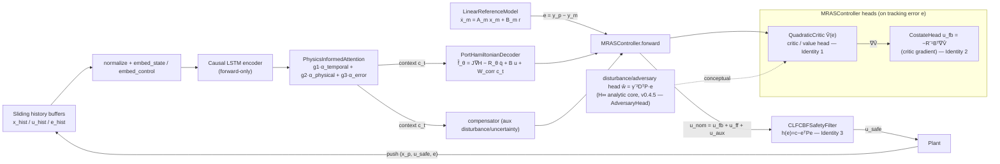

# PITS-MRAS — Architecture & Design Document

> Engineering blueprint distilled from the two source design documents:
> - **Blueprint** — *Tightening the RL–Optimal-Control Unification in PITS-MRAS: A Mathematical and Architectural Blueprint* (12 pages).
> - **Implementation Plan** — *PITS-MRAS: Complete Implementation Plan for Claude Code* (48 pages, §0–§14).
>
> Every major claim is annotated with a page marker pointing at the source `.txt`
> page where it appears. `[BP PAGE N]` = Blueprint; `[IP PAGE N]` = Implementation
> Plan. Section numbers (`§N`) are reproduced verbatim from the Implementation Plan.
>
> **Governing precedence.** The Implementation Plan's §0 declares: "This document
> is a complete, self-contained specification for building out the PITS-MRAS
> repository... The mathematical identities in §3 are load-bearing; implement them
> incorrectly and the theoretical guarantees collapse." `[IP PAGE 1]` It also
> states "The mathematical specification in docs/PITS-MRAS — Physics-Informed...md
> (1,543 lines) is your source of truth for the existing design; this plan extends
> it with RL-optimal control connections derived from the companion reference
> document." `[IP PAGE 1]` This document therefore prefers the Implementation Plan
> for paths, phases, and code signatures, and the Blueprint for the deeper
> mathematical motivation of the ten identities.
>
> **IMPORTANT — naming caveat.** The Blueprint speaks of "~7 new loss terms, 3 new
> network heads (critic/value, disturbance/adversary, CBF filter), and a
> re-derived adaptation law" `[BP PAGE 1]` at a conceptual level. The
> Implementation Plan §2–§12 then defines the **concrete file layout and class
> names that actually get built**, and these differ from the abstract Blueprint
> nouns (e.g. there is no standalone `adversary.py` in the plan; the H∞/adversary
> connection is described in the Blueprint but the plan implements the IRL critic,
> costate head, and CBF filter as the three concrete new heads). Where the two
> diverge, **the file/class names below come from the Implementation Plan**, which
> is the buildable artifact. Divergences are flagged in §8.3.

---

## 0. Implemented Architecture (v0.4.5) — graph-backed

> **Status:** all nine ROADMAP phases are implemented (released **v0.3.0**) plus
> the **PCML** (Physics-Constrained Machine Learning) component; **v0.3.1** was a
> behavior-preserving simplification/optimization pass, **v0.3.2** and **v0.3.3**
> behavior-preserving engineering-debt-resolution releases, and the **v0.4.x**
> feature/refinement line is underway (**v0.4.0** HJB/costate co-training rewire,
> **v0.4.1** removed 6 unconsumed `LossConfig` fields, **v0.4.2** backtracking
> line search in the KKT projection, **v0.4.3** nonlinear example plants,
> **v0.4.4** ParallelInferenceEngine hardening, **v0.4.5** H∞ adversary core —
> `solve_gare` + analytic `AdversaryHead`). The
> structure below is generated from the codebase by
> `tools/create-dependency-graph/create_dependency_graph.py` and cross-checked
> against the source; regenerate with `python tools/create-dependency-graph/create_dependency_graph.py --include-tests`.
>
> **Companion docs** (this folder, all graph-backed): [`OVERVIEW.md`](OVERVIEW.md)
> (orientation), [`COMPONENTS.md`](COMPONENTS.md) (per-module breakdown),
> [`API.md`](API.md) (public API reference), [`DATAFLOW.md`](DATAFLOW.md) (runtime
> data flow), [`DEPENDENCY_GRAPH.md`](DEPENDENCY_GRAPH.md) (full import graph +
> Mermaid), [`TEST_COVERAGE.md`](TEST_COVERAGE.md), and
> [`unused-analysis.md`](unused-analysis.md). The sections below (§1+) are the
> original design blueprint; this section is the as-built summary.

### 0.1 Module map (as built)

The package lives under `src/pits_mras/` (src-layout). The dependency graph
finds **50 first-party Python files across 11 modules** (incl. `examples/`):

| Module | Files | Responsibility |
|--------|-------|----------------|
| `src/pits_mras` | 2 | Package root: `config.py` (8 dataclasses incl. `PCMLConfig`, `lambda_cbf`, `adaptive_weighting`) + `__init__.py` (flat public API) |
| `utils` | 7 | Foundation math: `lyapunov.py` (Lyapunov/Riccati/Kleinman + GARE + differentiable CARE/GARE), `hamiltonian.py`, `pe_monitor.py`, `diagnostics.py` (rollout-stability), `uq.py` (ensembles + conformal), `linearization.py` (Jacobian linearization of a dynamics callable) |
| `models` | 9 | `pitnn.py`, `attention.py`, `decoders.py` (port-Hamiltonian, MIMO `B@u`), `critic.py` (critic + costate + analytic adversary), `pcml.py` (soft+hard PCML, `torch.func` Jacobians), `lagrangian_head.py`, `adversary.py` (`NeuralAdversary`), `koopman.py` (deep Koopman lifting) |
| `losses` | 7 | `physics.py`, `temporal.py`, `stability.py`, `irl.py`, `hjb.py`, `adaptive_weighting.py` (ReLoBRaLo + causal) + `TotalLoss` aggregator |
| `controllers` | 5 | `reference_models.py`, `safety.py` (CLF-CBF), `mras.py` (actor-critic MRAS controller), `koopman_control.py` (`KoopmanLQRController` — CARE on lifted coords) |
| `constraints` | 4 | `base.py` (`PhysicsConstraints` ABC), `mechanical.py`, `thermal.py` — PCML DAE systems |
| `training` | 5 | `pretrain.py` (3-stage curriculum, opt-in dataset), `cotrain.py` (closed-loop actor-critic + IRL + PCML), `irl_trainer.py`, `hinf_minmax.py` (H∞ neural min-max) |
| `inference` | 3 | `realtime.py` (closed-loop engine), `parallel.py` (thread skeleton) |
| `data` | 2 | `trajectory.py` — `TrajectoryDataset`, `generate_synthetic_trajectories`, `make_dataloader` (opt-in dataset path) |
| `examples` | 5 | Runnable demos: robotic manipulator, autonomous vehicle, building HVAC, hard-PCML heat diffusion + `plants.py` (nonlinear plant steps) |
| `root` | 1 | `setup.py` |

### 0.2 Layering and health

The runtime stack is layered foundation → models → losses → controllers /
constraints → training → inference, composing at runtime as **PITNN → PCML
projection → MRAS controller (costate-head feedback) → CLF-CBF safety filter →
plant**. The dependency graph reports **0 circular dependencies** and **0 unused
files / exports**.

Key statistics (graph-generated): 50 files · 11 modules · ~8,054 LOC · 154
public exports (55 re-exported through barrels) · 52 classes · 1 ABC
(`PhysicsConstraints`) · 46 functions · 10 `TYPE_CHECKING`-guarded imports.

---

## 1. Overview & Goals

### 1.1 What PITS-MRAS Is — The Three-Paradigm Merger

PITS-MRAS (Physics-Informed Time-Series Model-Reference Adaptive System) merges
three paradigms `[IP PAGE 1, §1]`:

1. **Physics-Informed Neural Networks (PINNs)** — "the PITNN encoder enforces
   conservation laws via port-Hamiltonian structure (Hamiltonian H_θ,
   skew-symmetric interconnection J, positive-definite dissipation R_θ = LᵀL)."
   `[IP PAGE 1]`
2. **Time-Series Deep Learning** — "LSTM encoder + multi-head physics-informed
   attention (temporal, physical, error-driven) processes the state/control
   history." `[IP PAGE 1]`
3. **Model-Reference Adaptive Systems (MRAS)** — "a linear reference model
   ẋ_m = A_m x_m + B_m r (Hurwitz A_m) defines the desired closed-loop behavior;
   a Lyapunov function V(e,θ̃,θ̃_c) = eᵀPe + … guarantees tracking-error
   convergence." `[IP PAGE 2]`

### 1.2 The Core Upgrade — Formal Unification with RL / Optimal Control

"The core upgrade this plan implements is the formal unification with RL/optimal
control theory through ten mathematical identities." `[IP PAGE 2, §1]` The
Blueprint frames the highest-leverage moves: "The single highest-leverage move is
to recognize your MRAS Lyapunov function V(e)=eᵀPe is an LQR/tracking value
function: replacing the manual V̇<0 → emergency backup heuristic with (a) an
Integral-RL policy-evaluation update (Vrabie–Lewis 2009) and (b) a CLF-CBF-QP
safety filter (Ames et al. 2017) gives you formal optimality + forward-invariance
guarantees for near-zero implementation cost." `[BP PAGE 1, TL;DR]`

"Six of the ten connections are already rigorous, publishable identities... The
remaining four... are sound but add the most implementation complexity."
`[BP PAGE 1]`

The Implementation Plan elevates the three highest-rigor/lowest-cost identities as
the priority spine `[IP PAGE 2, §1]`:
- **Identity 1 — Lyapunov = Value Function** (IRL critic + Kleinman policy iteration).
- **Identity 2 — Costate = Critic Gradient** (action head = autodiff gradient of value).
- **Identity 3 — CLF-CBF-QP Safety Filter** (closed-form single-constraint projection).

"The remaining seven connections are implemented as optional modules that can be
enabled via configuration flags without breaking the baseline." `[IP PAGE 2]`

---

## 2. Canonical Module Layout (derived from Implementation Plan §2–§12)

> **Critical note for the scaffolding task.** The Implementation Plan does **not**
> present a single verbatim ASCII directory tree under a heading literally named
> "§2 Target Repository Layout." Its §2 is titled **"Updated Dependencies"**
> `[IP PAGE 2]`. The authoritative file paths are instead given **inline,
> file-by-file, throughout §4–§12** as "Create `src/pits_mras/...`" directives.
> The tree below is **assembled verbatim from those inline `Create ...` paths**;
> each path is cited to the page where the plan instructs its creation. This is
> the single source of truth for scaffolding. (See Gap G0 in §8.3.)

```
src/pits_mras/__init__.py                          [IP PAGE 6, §4.1]
src/pits_mras/config.py                            [IP PAGE 7, §4.2]
src/pits_mras/models/__init__.py                   [IP PAGE 6, §4.1]
src/pits_mras/models/attention.py                  [IP PAGE 16, §5.1]
src/pits_mras/models/decoders.py                   [IP PAGE 18, §5.2]
src/pits_mras/models/critic.py                     [IP PAGE 22, §5.3]
src/pits_mras/models/pitnn.py                      [IP PAGE 25, §5.4]
src/pits_mras/controllers/__init__.py              [IP PAGE 6, §4.1]
src/pits_mras/controllers/reference_models.py      [IP PAGE 31, §7.1]
src/pits_mras/controllers/safety.py                [IP PAGE 33, §7.2]
src/pits_mras/controllers/mras.py                  [IP PAGE 35, §7.3]
src/pits_mras/losses/__init__.py                   [IP PAGE 6, §4.1] / TotalLoss [IP PAGE 31, §6.6]
src/pits_mras/losses/physics.py                    [IP PAGE 28, §6.1]
src/pits_mras/losses/temporal.py                   [IP PAGE 28, §6.2]
src/pits_mras/losses/stability.py                  [IP PAGE 29, §6.3]
src/pits_mras/losses/irl.py                        [IP PAGE 29, §6.4]
src/pits_mras/losses/hjb.py                        [IP PAGE 31, §6.5]
src/pits_mras/training/__init__.py                 [IP PAGE 6, §4.1]
src/pits_mras/training/pretrain.py                 [IP PAGE 38, §8.1]
src/pits_mras/training/cotrain.py                  [IP PAGE 39, §8.2]
src/pits_mras/training/irl_trainer.py              [IP PAGE 40, §8.3]
src/pits_mras/inference/__init__.py                [IP PAGE 6, §4.1]
src/pits_mras/inference/realtime.py                [IP PAGE 40, §9.1]
src/pits_mras/inference/parallel.py                [IP PAGE 42, §9.2]
src/pits_mras/utils/__init__.py                    [IP PAGE 6, §4.1]
src/pits_mras/utils/lyapunov.py                    [IP PAGE 10, §4.3]
src/pits_mras/utils/hamiltonian.py                 [IP PAGE 13, §4.4]
src/pits_mras/utils/pe_monitor.py                  [IP PAGE 14, §4.5]
examples/robotic_manipulator.py                    [IP PAGE 43, §10.1]
examples/autonomous_vehicle.py                     [IP PAGE 43, §10.2]
examples/building_hvac.py                          [IP PAGE 43, §10.3]
tests/test_identity_lyapunov_value.py              [IP PAGE 43, §11.1]
tests/test_identity_costate.py                     [IP PAGE 44, §11.2]
tests/test_safety.py                               [IP PAGE 44, §11.3]
tests/test_models.py                               [IP PAGE 44, §11.4]
tests/test_irl.py                                  [IP PAGE 45, §11.5]
tests/test_smoke.py                                [IP PAGE 45, §11.6]
.github/workflows/ci.yml                           [IP PAGE 45, §12]
pyproject.toml                                     [IP PAGE 46, §12]
```

The package `__init__.py` exposes these top-level symbols verbatim `[IP PAGE 6, §4.1]`:

```python
from pits_mras.models.pitnn import PITNN
from pits_mras.models.critic import QuadraticCritic
from pits_mras.controllers.mras import MRASController
from pits_mras.controllers.reference_models import LinearReferenceModel
from pits_mras.controllers.safety import CLFCBFSafetyFilter
from pits_mras.training.pretrain import pretrain_pitnn
from pits_mras.training.cotrain import cotraining_loop
from pits_mras.inference.realtime import RealtimeInferenceEngine
__version__ = "0.1.0"
```

Empty `__init__.py` files (docstrings only, no imports) are created in:
`models/`, `controllers/`, `losses/`, `training/`, `inference/`, `utils/`.
`[IP PAGE 6, §4.1]`

### 2.1 Subpackage Roles & Build Phases

| Subpackage / file | Phase | Role | Source |
|---|---|---|---|
| `config.py` | Phase 1 Foundation | dataclass config (NetworkConfig, PhysicsConfig, MRASConfig, SafetyConfig, LossConfig, TrainingConfig → PITSMRASConfig) with `from_yaml`/`to_yaml`. | `[IP PAGE 7, §4.2]` |
| `utils/lyapunov.py` | Phase 1 | `solve_lyapunov`, `kleinman_iteration`, `solve_care`, `check_hurwitz`, `lyapunov_derivative`, `quadratic_basis`. "the mathematical engine for all P-matrix computations." | `[IP PAGES 10–12, §4.3]` |
| `utils/hamiltonian.py` | Phase 1 | `make_skew_symmetric`, `make_positive_definite`, `port_hamiltonian_energy_loss`, `hamiltonian_positivity_loss`. | `[IP PAGES 13–14, §4.4]` |
| `utils/pe_monitor.py` | Phase 1 | `PEMonitor` — checks persistence-of-excitation Gram min-eigenvalue, injects probing noise. | `[IP PAGE 14, §4.5]` |
| `models/attention.py` | Phase 2 Models | `PhysicsInformedAttention` (temporal + physical + error-driven, learned 3-way gate). | `[IP PAGE 16, §5.1]` |
| `models/decoders.py` | Phase 2 | `HamiltonianNet`, `DissipationNet`, `PortHamiltonianDecoder`. | `[IP PAGE 18, §5.2]` |
| `models/critic.py` | Phase 2 | `QuadraticCritic` (V̂=Wᵀφ(e)), `CostateHead` (λ̂=∇V̂, u*=−R⁻¹Bᵀλ̂), `AdversaryHead` (H∞ worst-case w*=γ⁻²DᵀPe, v0.4.5). NEW — Identity 1 & 2. | `[IP PAGE 22, §5.3]` |
| `models/pitnn.py` | Phase 2 | `PITNN` — embedding → causal LSTM → attention → port-Hamiltonian decoder (Algorithm 1). | `[IP PAGE 25, §5.4]` |
| `losses/physics.py` | Phase 3 Losses | `PhysicsLoss`: λ₁L_energy+λ₂L_PDE+λ₃L_BC+λ₄L_sym. | `[IP PAGE 28, §6.1]` |
| `losses/temporal.py` | Phase 3 | `MultiStepPredictionLoss`, `AttentionRegularizationLoss`, `TemporalSmoothnessLoss`, `TemporalLoss`. | `[IP PAGE 28, §6.2]` |
| `losses/stability.py` | Phase 3 | `LyapunovConstraintLoss`, `ParameterBoundednessLoss`, `ControlEffortLoss`, `MRASStabilityLoss`. | `[IP PAGE 29, §6.3]` |
| `losses/irl.py` | Phase 3 | `IRLBellmanAccumulator`, `IRLBellmanLoss`. NEW — Identity 1. | `[IP PAGE 29, §6.4]` |
| `losses/hjb.py` | Phase 3 | `HJBResidualLoss`, `LyapunovDecreaseEnforcer`. NEW — Identity 8. | `[IP PAGE 31, §6.5]` |
| `losses/__init__.py` | Phase 3 | `TotalLoss` aggregator + per-loss TB/wandb logging. | `[IP PAGE 31, §6.6]` |
| `controllers/reference_models.py` | Phase 4 Controllers | `LinearReferenceModel` (verifies Hurwitz, solves Lyapunov + Kleinman). | `[IP PAGE 31, §7.1]` |
| `controllers/safety.py` | Phase 4 | `CLFCBFSafetyFilter` (closed-form CBF projection). NEW — Identity 3. | `[IP PAGE 33, §7.2]` |
| `controllers/mras.py` | Phase 4 | `MRASController` (critic + costate head + K_ff + compensator + CBF). | `[IP PAGE 35, §7.3]` |
| `training/pretrain.py` | Phase 5 Training | 3-stage curriculum (1A/1B/1C), Algorithm 2. | `[IP PAGE 38, §8.1]` |
| `training/cotrain.py` | Phase 5 | co-training with IRL update, Algorithm 3 extended. "the most critical training file." | `[IP PAGE 39, §8.2]` |
| `training/irl_trainer.py` | Phase 5 | standalone offline IRL critic pre-training (batch least-squares). | `[IP PAGE 40, §8.3]` |
| `inference/realtime.py` | Phase 6 Inference | `RealtimeInferenceEngine` — 4(–7)-step closed loop, thread-safe buffers. | `[IP PAGE 40, §9.1]` |
| `inference/parallel.py` | Phase 6 | `ControlThread` (1kHz), `AdaptationThread` (100Hz), `MonitorThread` (10Hz). | `[IP PAGE 42, §9.2]` |
| `examples/*` | Phase 7 | robotic_manipulator, autonomous_vehicle, building_hvac. | `[IP PAGE 43, §10]` |
| `tests/*` | Phase 8 | identity, safety, model, irl, smoke tests. | `[IP PAGES 43–45, §11]` |
| `.github/workflows/ci.yml`, `pyproject.toml` | Phase 9 CI/CD | lint+mypy+pytest matrix (py3.9/3.10/3.11), tooling config. | `[IP PAGES 45–47, §12]` |

---

## 3. Identity → Module Mapping

The Blueprint enumerates **ten connections** `[BP PAGES 2–9]`. It classifies six
as "already rigorous, publishable identities" (Connections 1, 2, 3, 4, 5, 7
per the TL;DR list: Lyapunov-equation=ARE special case; H_θ as storage/value
function; costate λ=∇V=critic gradient; MRAS law as deterministic policy
gradient; SAC-α=R⁻¹ control penalty; H∞=two-player game) and "the remaining four
(physics-informed Bellman/HJB residual, TD-MPC2 latent planning, neural Lyapunov
certificates, generalized Lyapunov)" as sound but higher-complexity.
`[BP PAGE 1, TL;DR]`

> **Two numbering systems exist.** The Blueprint's "Connections 1–10" `[BP PAGES
> 2–9]` and the Implementation Plan's "Identity 1–8 / Connection N" labels on the
> code `[IP PAGES 2, 4–5]` are **not identical numberings**. The plan's code
> comments tag, e.g., `critic.py` as "Identity 1 & 2" and `mras.py`'s adaptation
> upgrade as "Identity 4 — DPG connection." The table below uses the
> **Implementation Plan's code-level identity tags** as primary (since those drive
> the build) and cross-references the Blueprint connection.

| Plan Identity tag | Blueprint Connection | Statement (abridged, grounded) | Rigor | Owning module(s)/file(s) | Source |
|---|---|---|---|---|---|
| Identity 1 — Lyapunov = Value Function | Connection 1 (ADP/Integral RL) | `A_mᵀP+PA_m=−Q` IS Kleinman's 1968 policy-evaluation step; IRL Bellman makes it model-free. | Rigorous | `utils/lyapunov.py`, `models/critic.py`, `losses/irl.py`, `training/irl_trainer.py` | `[IP PAGES 2,4; BP PAGE 2]` |
| Identity 2 — Costate = Critic Gradient | Connection 3 | PMP costate λ(t)=∂V/∂e; u*=−R⁻¹Bᵀ∇V̂; action head = autodiff grad of scalar value head. | Rigorous | `models/critic.py` (`CostateHead`), used in `controllers/mras.py` | `[IP PAGES 4–5; BP PAGE 4]` |
| Identity 3 — CLF-CBF-QP Safety Filter | Connection 6 | h(e)=c−eᵀPe; closed-form single-constraint projection; one P serves CLF+CBF. | Rigorous | `controllers/safety.py` | `[IP PAGES 5; BP PAGE 6]` |
| Identity 4 — Updated Adaptation Law (DPG) | Connection 4 | MRAS update θ̇_c=−Γ_c(∇L+γ_MRAS e φ_c) IS deterministic policy gradient; replace surrogate eᵀPe with learned critic gradient. | Rigorous | `controllers/mras.py`, `training/cotrain.py` | `[IP PAGE 5; BP PAGE 4]` |
| Identity 8 — HJB Residual Loss | Connection 8 | 0=ℓ(e,u*)+∇_eV̂·(A_m e+B u*+f_corr); add as PINN-style residual. | Higher complexity | `losses/hjb.py` | `[IP PAGE 5; BP PAGE 7]` |
| (port-Hamiltonian storage = value) | Connection 2 | H_θ is a storage/value function; passivity = L2-gain. | Rigorous | `models/decoders.py`, `utils/hamiltonian.py` | `[BP PAGE 4; IP PAGE 13]` |
| (SAC entropy ↔ R-matrix) | Connection 5 | SAC temperature α ≡ control-penalty R⁻¹; entropy bonus = excitation. | Rigorous | **No dedicated module** (see G1). PE/excitation surfaced via `utils/pe_monitor.py` + attention entropy reg. | `[BP PAGE 5; IP PAGE 14]` |
| (H∞ two-player game) | Connection 7 | H∞ robust control = zero-sum game; add disturbance/adversary head. | Rigorous | **Analytic core built in v0.4.5** (see G1): `solve_gare` (GARE) + `AdversaryHead` (`w*=γ⁻²DᵀPe`). **Neural min-max training loop shipped in v0.5.0** (`NeuralAdversary` + `hinf_minmax_train`, `training/hinf_minmax.py`; recovers the GARE oracle). | `[BP PAGE 6]` |
| (TD-MPC2 latent planning) | Connection 9 | PITNN is a learned world model → latent MPC + terminal value head. | Higher complexity | **No dedicated module** (see G1). | `[BP PAGE 8]` |
| (Neural / generalized Lyapunov) | Connection 10 | keep V=eᵀPe backbone; add learned residual V=eᵀPe+φ_NN(e) only for nonlinear regime. | Higher complexity | optional `nonlinear_residual` flag in `QuadraticCritic` | `[BP PAGE 9; IP PAGE 22]` |

*Note: the **Rigor** column (Rigorous / Higher complexity) is a synthesis derived
from the Blueprint's "bang for buck" / rigor discussion (its 6-rigorous-vs-4-complex
split and prioritized-tier ranking, `[BP PAGE 1, 9–10]`), not a verbatim priority
label attached to each identity in the source documents.*

**Multi-identity owners (verbatim):**
- `models/critic.py` — "Critic / Value Network (NEW — Identity 1 & 2)." `[IP PAGE 22, §5.3]`
- `controllers/mras.py` — "combining: Classical MRAS feedback/feedforward structure; IRL critic-guided actor update (Identity 1, 4); Costate-based optimal control action (Identity 2); CLF-CBF safety filter (Identity 3)." `[IP PAGE 36, §7.3]`
- `controllers/reference_models.py` — links reference model A_m to value function: "the MRAS Lyapunov equation A_mᵀP+PA_m=−Q uses this same A_m to compute P, linking the reference model directly to the value function (Identity 1)." `[IP PAGE 31, §7.1]`

---

## 4. New Components

### 4.1 New Loss Terms

The Blueprint motivates "~7 new loss terms" `[BP PAGE 1]`. The Implementation Plan
realizes the **net-new, RL-derived** loss modules as follows (the pre-existing
physics/temporal/stability losses are ported from the original technical spec, not
new):

| Loss term / class | Enforces | Description (verbatim/abridged) | File | Source |
|---|---|---|---|---|
| `IRLBellmanLoss` / `L_IRL` | Identity 1 | `δ_IRL(t)=∫_{t−T}^{t} r dτ − [V̂(e(t))−V̂(e(t−T))]`, `L_IRL=½E[δ_IRL²]`; "does NOT contain the drift matrix A → model-free." | `losses/irl.py` | `[IP PAGES 4,29; §3.2,§6.4]` |
| `HJBResidualLoss` / `L_HJB` | Identity 8 | `‖eᵀQe+(u*)ᵀRu*+∇_eV̂·(A_m e+B u*+f_corr)‖²`; "Start with weight λ_HJB=0.01... treat it as a regularizer." | `losses/hjb.py` | `[IP PAGES 5,31; §3.5,§6.5]` |
| `LyapunovDecreaseEnforcer` / `L_dec` | (Lyapunov decrease) | `L_dec=E[ReLU(∇V̂·f̂+ℓ)]` — "tighter than the existing L_Lyap." | `losses/hjb.py` | `[IP PAGE 31, §6.5]` |
| `L_costate` (gradient consistency) | Identity 2 | **Removed in v0.4.0** — vacuous: `λ̂ ≡ ∇_eV̂` by construction (the costate head IS the critic gradient), so `L_costate ≡ 0`. Identity 2 holds by construction, not by this loss. | (was `cotrain.py`) | `[IP PAGES 5,39; §3.3,§8.2]` |
| `L_adjoint` (adjoint dynamics) | Identity 2 | `L_adjoint=‖λ̇(t)+∂H/∂e‖²` along trajectories. **Not implemented** (the `lambda_adjoint` weight was a dead config knob, removed in v0.4.1); a future feature if needed. | (none) | `[IP PAGES 5,9; §3.3,§4.2]` |
| `cbf_constraint_loss` | Identity 3 | soft penalty `ReLU(−h_e).mean()` on CBF violation; added to L_total. | `controllers/safety.py` | `[IP PAGE 35, §7.2]` |
| `positivity_loss` (critic) | Identity 1 | `ReLU(−min_eig(P̂))` — penalizes non-PD P̂. | `models/critic.py` | `[IP PAGE 24, §5.3]` |

Pre-existing (ported, augmented) losses: `PhysicsLoss` (energy+PDE+BC+sym)
`[IP PAGE 28]`, `TemporalLoss` (multi-step pred + attention reg + smoothness)
`[IP PAGE 28]`, `MRASStabilityLoss` (Lyapunov constraint + param boundedness +
control effort) `[IP PAGE 29]`.

All weights live in `LossConfig` `[IP PAGE 9, §4.2]`: `lambda_physics`,
`lambda_temporal`, `lambda_stability`, `lambda_data`, `lambda_irl`, `lambda_hjb`
(default `0.0`; opt-in critic regularizer), `lambda_pcml`, plus the physics
sub-weights (`lambda_energy`/`lambda_pde`/`lambda_bc`/`lambda_sym`). (`lambda_costate`
was removed in v0.4.0 with the vacuous costate term; the 6 unconsumed weights
`lambda_adjoint`/`alpha_attn`/`alpha_smooth`/`mu_lyap`/`beta_param`/`lambda_delta_u`
were removed in v0.4.1.) `TotalLoss` logs each sub-loss separately under
`loss/physics`, `loss/temporal`, `loss/stability`, `loss/irl`, `loss/hjb`,
`loss/data`. `[IP PAGE 31, §6.6]`

### 4.2 The Three New Network Heads

The Blueprint names "3 new network heads (critic/value, disturbance/adversary, CBF
filter)" `[BP PAGE 1]`. The Implementation Plan **concretely builds** the
following three new heads (note: the disturbance/adversary head from the Blueprint
is NOT given a concrete module in the plan — see G1; the plan's third concrete new
head is the costate head):

1. **Critic / Value head — `QuadraticCritic`** — "V̂(e)=W_cᵀφ_c(e)... V̂(e)=eᵀP̂e
   where P̂ is learned via the IRL Bellman error." Quadratic Kronecker basis
   guarantees the LQR limit P̂→P_CARE is exactly representable and ∇_eV̂=2P̂e is
   analytic. Optional `nonlinear_residual` MLP for the nonlinear regime
   (Connection 10). Methods: `forward`, `gradient` (= costate λ̂), `extract_P`,
   `positivity_loss`. `[IP PAGE 22, §5.3]`
2. **Costate head — `CostateHead`** — "the action head is never an independent
   network — it IS the gradient of the critic." Returns `(lambda_hat, u_optimal)`
   with `u* = −R⁻¹Bᵀ∇V̂`. Enforces Identity 2 by construction. `[IP PAGE 24, §5.3]`
3. **CBF safety-filter head — `CLFCBFSafetyFilter`** — closed-form projection of
   nominal control onto the safe half-space; "the same P matrix used for the
   Lyapunov CLF (V=eᵀPe) also serves as the CBF (h=c−eᵀPe)." `[IP PAGE 33, §7.2]`

### 4.3 The Re-Derived Unified Adaptation Law

The Implementation Plan's §3.6 "Updated Adaptation Law (DPG Identity, Identity 4)"
`[IP PAGE 5]`:

```
Classical:  θ̇_c = −Γ_c (∇L_total + γ_MRAS · e · φ_c)        [DPG with fixed surrogate eᵀPe]
Upgraded:   θ̇_c = −Γ_c [ ∇_{θ_c} L_total + φ_c · ∇_a Q̂(e,u)|_{a=u} ]
```

"where ∇_a Q̂ reduces to Pe (up to factor 2) in the LQR limit, confirming backward
compatibility. Implement this as a custom optimizer step that adds the DPG term
after the standard gradient step." `[IP PAGE 5, §3.6]` The regressor is
`φ_c = [eᵀ, rᵀ, x_pᵀ]ᵀ` (`mras_regressor` in `MRASController`). `[IP PAGE 36, §7.3]`

> The Blueprint's higher-tier re-derivation also adds an explicit Integral-RL
> term: "δ_IRL(t) = ∫[t−T,t] (eᵀQe + uᵀRu) ds + V̂(e(t)) − V̂(e(t−T)), and update
> the critic by least-squares/gradient on ½δ_IRL²... structurally identical to
> your β_MRAS·e·φ_θ term." `[BP PAGE 3]` This is realized as the policy-evaluation
> (critic) half of the loop while the DPG term above is the actor half — together
> turning MRAS into a full actor-critic (synchronous policy iteration,
> Vamvoudakis–Lewis 2010). `[BP PAGE 3]`

---

## 5. Data Flow



### 5.1 State / Control History Pipeline

The forward pass is Algorithm 1 in `PITNN.forward` `[IP PAGE 25, §5.4]`, then the
controller and safety filter:

```
 sliding history window (deque, maxlen = horizon=memory_horizon)
 x_hist [b,T,input_dim], u_hist [b,T,input_dim], e_hist [b,T,e_dim]
        │
        ▼  (1) normalize + embed_state / embed_control
 seq [b,T,2*emb_dim]
        │
        ▼  (2) Causal LSTM encoder (forward-only — "no information leakage from future")
 H_enc [b,T,hidden_dim]
        │
        ▼  (3) PhysicsInformedAttention(H_enc, e_hist, x_p, e_curr, x_p_dot, u_curr)
        │      = g1·α_temporal + g2·α_physical + g3·α_error  (learned 3-way gate)
 context c_t [b,hidden_dim], alpha [b,T]
        │
        ▼  (4) PortHamiltonianDecoder(q, p, q_dot, u_curr, c_t)
        │      f̂_θ = J∇H − R_θ q̇ + B(x_p)u + W_corr c_t + b_corr
 f_hat [b,output_dim], H_val, P_diss, energy_loss
        │
        ▼  reference model:  x_m ← A_m x_m + B_m r ;  e = y_p − y_m
        │
        ▼  (5) MRASController.forward(e, x_p, x_m, r, context):
        │        u_fb = −R⁻¹Bᵀ∇V̂   (CostateHead — critic gradient)   [Identity 2]
        │        u_ff = K_ff r
        │        u_aux = compensator([context[:state_dim], x_p])
        │        u_nom = u_fb + u_ff + u_aux
        │        V_hat = critic(e)                                    [Identity 1]
        │
        ▼  (6) CLFCBFSafetyFilter(e, u_nom):                          [Identity 3]
        │        h(e)=c−eᵀPe ; L_f h=−2eᵀPA_m e ; L_g h=−2eᵀPB
        │        a = L_f h + (L_g h)·u_nom + γ h
        │        u_safe = u_nom + ReLU(−a)/‖L_g h‖² · (L_g h)
        │
        ▼  apply u_safe to plant ; push (x_p, u_safe, e) into history buffers
```

**Where the critic / value head attaches.** The critic is a head on the
**tracking error e**, held inside `MRASController` (not the PITNN encoder); its
gradient (the costate) IS the feedback control. `[IP PAGE 35, §7.3]` The attention
**context c_t** from the PITNN feeds the controller's auxiliary compensator
(`context[:, :state_dim]`) and the decoder's temporal correction `W_corr c_t`.
`[IP PAGES 27, 37]`

**Where the disturbance / adversary head attaches.** *Not realized as a module in
the Implementation Plan* (see G1). The Blueprint specifies it conceptually:
"add a disturbance/adversary head ŵ = K_w·x_p that maximizes the cost, train the
critic on the game-Bellman residual, and set γ from your reference-model
performance bound." `[BP PAGE 6, Connection 7]` In the plan, the closest realized
robustness mechanism is the `compensator` (auxiliary disturbance/uncertainty
network) inside `MRASController` `[IP PAGE 36, §7.3]` and the CBF filter.

### 5.2 Reference Model

`LinearReferenceModel`: `ẋ_m = A_m x_m + B_m r`, `y_m = C_m x_m`, Hurwitz `A_m`
verified at construction. On init it solves the Lyapunov equation for `P` (policy
evaluation) **and** runs `kleinman_iteration` to obtain `(P_opt, K_opt)`, all
stored as buffers (`P`, `P_opt`, `K_opt`, `R_inv`). `step()` does Euler
integration. `[IP PAGE 31, §7.1]`

---

## 6. Training & Inference

### 6.1 Pre-Training Curriculum (Algorithm 2, `pretrain.py`)

Three stages over `pretrain_epochs=5000` `[IP PAGE 38, §8.1]`:

| Stage | Epochs | Objective | Source |
|---|---|---|---|
| 1A | 1–1000 | Minimize only `λ_physics·L_physics + 0.1·L_data`; collocation points sampled uniformly in state-control-time domain. | `[IP PAGE 38]` |
| 1B | 1001–3000 | Cosine-anneal `λ_data` 0.1→1.0: `λ_data = 0.1 + 0.9·(1−cos(π(epoch−1000)/2000))/2`. | `[IP PAGE 38]` |
| 1C | 3001–5000 | Activate LSTM/attention by adding `L_temporal` with linear warm-up: `λ_temp = λ_temp_final·(epoch−3000)/2000`. | `[IP PAGE 38]` |

Validation criterion: "`L_physics < ε_tol` must hold throughout. If it spikes
above threshold, reduce the data weight `λ_data` by 0.5 and log a warning."
`[IP PAGE 39]`

### 6.2 Co-Training (Algorithm 3 extended, `cotrain.py`)

"the most critical training file." `[IP PAGE 39, §8.2]` After the standard
gradient update it adds, in order:
1. **IRL critic update** (Identity 1): push `(e, r_inst)` to `IRLBellmanAccumulator`; when ready, backprop `L_irl` on the critic with grad-clip 1.0 via a **separate `critic_optimizer`** (Adam lr=1e-3), then a **policy-improvement** read `K_new = R⁻¹BᵀP̂` (implicit via the costate head). `[IP PAGE 39]`
2. **HJB residual update** — opt-in (`lambda_hjb>0`), applied to the critic via `critic_optimizer` (v0.4.0; previously its gradient was discarded in `L_total`). `[IP PAGE 39]`
3. **Critic positivity regularization** `1e-3·L_pos`, applied to the critic via `critic_optimizer`, guarded on `min_eig(P̂)<0` (v0.3.3). `[IP PAGE 39]`
4. **CBF constraint loss** `0.1·L_cbf` (if `enable_cbf`) — part of the PITNN `L_total`. `[IP PAGE 40]`

(The costate-consistency term was removed in v0.4.0: `λ̂ ≡ ∇V̂` by construction, so it was identically zero.)

Two optimizers: `optimizer_pitnn` (Adam lr=1e-4) for PITNN params and
`critic_optimizer` (Adam lr=1e-3) for the critic — "separate because the IRL
update has a different learning rate." `[IP PAGE 40]`

### 6.3 Standalone IRL Trainer (`irl_trainer.py`)

Offline critic pre-training "from a fixed dataset of trajectories... runs
Kleinman-style batch least-squares on the IRL Bellman equations and stops when
`‖P̂ − P_opt‖_F / ‖P_opt‖_F < 0.01`." `[IP PAGE 40, §8.3]`

### 6.4 Real-Time Inference (`realtime.py`, `parallel.py`)

`RealtimeInferenceEngine.step(x_p, r, dt)` runs the closed loop `[IP PAGE 40, §9.1]`:
measure x_p → update bounded `deque` buffers → PITNN forward → reference-model
step + error → controller forward → **CBF safety filter (replaces heuristic V̇<0
check)** → apply u_safe → log `V̂, h_CBF, ‖e‖`. Decorated `@torch.no_grad()` with a
`threading.Lock`; "Thread-safe buffer management for parallel deployment (1 kHz
control thread)."

Parallel architecture `[IP PAGE 42, §9.2]`:
- `ControlThread` — **1 kHz**, calls `engine.step()`, lock-free buffer.
- `AdaptationThread` — **100 Hz**, IRL critic update + policy improvement from a shared replay buffer; uses `copy.deepcopy` of the critic then atomic double-buffer swap.
- `MonitorThread` — **10 Hz**, computes V̂, ‖e‖, h_CBF, CBF activation rate.
Graceful shutdown via `threading.Event`.

---

## 7. Stability, Safety & Testing Strategy

### 7.1 Lyapunov / Value-Function Guarantee

`V(e) = eᵀPe` with `P>0` solving `A_mᵀP+PA_m=−Q`; this "IS the LQR value function
for the tracking-error system ė=A_m e + perturbation." `[IP PAGE 4, §3.2]` The
IRL critic learns P̂ from data; convergence target is `P_opt` from
`kleinman_iteration`/`solve_care`. `utils/lyapunov.py` provides
`solve_continuous_lyapunov`-based `solve_lyapunov` (raises if P not PD →
A_m not Hurwitz), `kleinman_iteration`, `solve_care`, `lyapunov_derivative`
(V̇=2eᵀP(A_m e + B u)), and `quadratic_basis`. `[IP PAGES 10–12, §4.3]`

### 7.2 CLF-CBF-QP Forward Invariance

`h(e)=c−eᵀPe` (safe set = error ellipsoid `eᵀPe≤c`); constraint
`L_f h + L_g h·u ≥ −γ h(e)` with `L_f h=−2eᵀPA_m e`, `L_g h=−2eᵀPB`. Closed-form
single-constraint solution (no QP solver) `[IP PAGE 5, §3.4]`:
```
a = L_f_h + (L_g_h·u_nom) + γ·h_e
u_safe = u_nom  if a≥0  else  u_nom − (a/‖L_g_h‖²)·L_g_h
```
"one P matrix simultaneously certifies stability (CLF: V̇<0) and safety (CBF:
forward invariance of error ellipsoid)." `[IP PAGE 34, §7.2]` Multi-constraint
CBF would need `cvxpy` (commented-out optional dep). `[IP PAGES 5, 3, §2]`

### 7.3 Test Suite (Phase 8, §11)

| Test file | Mandated tests (verbatim names) | Validates | Source |
|---|---|---|---|
| `test_identity_lyapunov_value.py` | `test_kleinman_converges_to_care`, `test_irl_critic_converges_to_lyapunov_P`, `test_quadratic_basis_reconstructs_P` | Identity 1 | `[IP PAGE 43, §11.1]` |
| `test_identity_costate.py` | `test_costate_equals_grad_V`, `test_optimal_control_equals_lqr_gain` | Identity 2 | `[IP PAGE 44, §11.2]` |
| `test_safety.py` | `test_cbf_projects_unsafe_control`, `test_cbf_identity_when_safe`, `test_cbf_forward_invariance` (100-step sim stays in safe set) | Identity 3 / forward invariance | `[IP PAGE 44, §11.3]` |
| `test_models.py` | `test_dissipation_matrix_psd`, `test_J_skew_symmetric`, `test_hamiltonian_positive` | port-Hamiltonian structure | `[IP PAGE 44, §11.4]` |
| `test_irl.py` | `test_irl_bellman_error_zero_at_true_value`, `test_irl_loss_decreases_with_correct_update` | IRL loss | `[IP PAGE 45, §11.5]` |
| `test_smoke.py` | `test_full_forward_pass_no_crash`, `test_pretrain_one_epoch`, `test_cotrain_one_episode` | end-to-end / no NaN | `[IP PAGE 45, §11.6]` |

Acceptance criteria per phase are explicit `[IP PAGE 47, §13]`, e.g. Phase 1
sanity: `solve_lyapunov(-I, I)` must print `[[0.5,0],[0,0.5]]`; final target
`pytest --cov=pits_mras` ≥ **60% coverage**. CI matrix: Python 3.9/3.10/3.11,
flake8 (max-line 100, ignore E203/W503), mypy, pytest+coverage→codecov.
`[IP PAGES 45–47, §12–§13]`

### 7.4 Persistence-of-Excitation Safeguard

`PEMonitor` tracks the min eigenvalue of the regressor Gram matrix over a sliding
window; injects probing noise if PE is violated — required because "IRL/ADP
parameter convergence requires PE of the regressor φ_c." `[IP PAGE 14, §4.5]` The
Blueprint flags the same caveat: "every IRL/ADP method... needs persistence of
excitation; injecting probing noise biases estimates unless handled." `[BP PAGE 9]`

---

## 8. Dependencies & Assumptions

### 8.1 Declared Environment & Libraries

The Implementation Plan §2 instructs replacing `requirements.txt` **entirely**
`[IP PAGES 2–3, §2]`:

```
numpy>=1.24.0    scipy>=1.10.0    torch>=2.1.0    torchvision>=0.16.0
control>=0.9.4   matplotlib>=3.7.0  seaborn>=0.12.0  pandas>=2.0.0
tqdm>=4.65.0     pyyaml>=6.0.0    tensorboard>=2.13.0  wandb>=0.15.0
pytest>=7.4.0    pytest-cov>=4.1.0  black>=23.0.0  flake8>=6.0.0
mypy>=1.4.0      isort>=5.12.0
# cvxpy>=1.3.0   (commented out — only for >1 CBF constraint)
```

And update `setup.py`: `name="pits_mras"`, `version="0.1.0"`,
`python_requires=">=3.9"`, `install_requires` = numpy/scipy/torch/control/
matplotlib/pandas/tqdm/pyyaml; `extras_require` `dev` (pytest, pytest-cov, black,
flake8, mypy, isort) and `logging` (tensorboard, wandb). `[IP PAGE 3, §2]`

> **Conflict with current scaffold (G2).** The repo's existing `setup.py` uses
> `name="pits-mras"`, `version="1.0.0"`; the plan mandates `name="pits_mras"`,
> `version="0.1.0"`. The plan also adds **`control>=0.9.4`** (Python Control
> Systems Library) and **`isort`/`torchvision`/`pytest-cov`** which are absent
> from the current `requirements.txt`. The plan's §2 says "Replace
> requirements.txt entirely." `[IP PAGE 2]`

Library usage explicitly referenced:
- **torch** — the current `requirements.txt` pins a minimum of **`torch>=2.0.0`**;
  the plan's replacement block raises this to `torch>=2.1.0` (with `torchvision>=0.16.0`). `[requirements.txt; IP PAGES 2–3, §2]`
- **scipy** — `solve_continuous_lyapunov`, `solve_continuous_are`. `[IP PAGE 10]`
- **control>=0.9.4** — "Python Control Systems Library (Riccati, Lyapunov solvers)." `[IP PAGE 2]` (Note: the actual `lyapunov.py` code shown uses scipy, not `control`; see G3.)
- **pyyaml** — `PITSMRASConfig.from_yaml/to_yaml`. `[IP PAGE 10]`
- **tensorboard/wandb** — `TotalLoss` per-sub-loss logging. `[IP PAGE 31]`
- **cvxpy** — optional, multi-constraint CBF only. `[IP PAGE 3]`

### 8.2 Explicit Assumptions (from the source docs)

- `A_m` **Hurwitz**, verified at `LinearReferenceModel` construction. `[IP PAGE 31]`
- `P>0`, `R_θ=LᵀL≥0` (Cholesky), `J=−Jᵀ`, `H_θ>0` (softplus output). `[IP PAGES 1,4,13]`
- **Causality**: forward-only LSTM, "no information leakage from future." `[IP PAGE 25]`
- Tensor convention `[batch, dim]` / `[batch, T, dim]`, never `[dim, batch]`. `[IP PAGE 47, §14]`
- Device from `cfg.training.device`; never hardcode `torch.cuda`. `[IP PAGE 48, §14]`
- Autograd: `e.requires_grad_(True)` before critic for costate; `create_graph=True` when differentiating the gradient (adjoint loss). `[IP PAGE 48, §14]`
- Default config dims: `input_dim=10`, `hidden_dim=128`, `output_dim=4`, `lstm_layers=2`, `attention_heads=4`, `memory_horizon=50`, `embedding_dim=64`, `n_generalized_coords=2`, `state_dim=4`, `control_dim=2`. `[IP PAGES 7–9, §4.2]`
- Blueprint's "factor-of-½ convention" caveat: keep V=eᵀPe vs ½xᵀPx bookkeeping consistent when wiring R⁻¹BᵀP. `[BP PAGE 10]`

### 8.3 Open Gaps / Ambiguities (FLAGGED — not filled in)

| ID | Gap | Where |
|---|---|---|
| **G0** | **No single verbatim "§2 target tree" exists in the source.** The plan's §2 is "Updated Dependencies." Paths are scattered inline as "Create `src/...`" across §4–§12. The tree in this doc's §2 was assembled from those inline directives and cited per-path. The orchestrator must rely on that assembled list, not a literal source block. | `[IP PAGE 2, §2]` |
| **G1** | **[PARTLY RESOLVED v0.4.5]** The Blueprint's "disturbance/adversary head" (H∞, Connection 7) originally had no concrete module (the plan built critic/costate/CBF). v0.4.5 added the **analytic H∞ core**: `solve_gare` (`utils/lyapunov.py`) + `AdversaryHead` (`models/critic.py`, `w*=γ⁻²DᵀPe`, by construction). So the "middle head" now exists alongside costate. **[RESOLVED v0.5.0]** the neural adversarial **min-max training loop** (`NeuralAdversary` + `hinf_minmax_train`). Remaining: Connection 5 (SAC/entropy) / Connection 9 (TD-MPC2) still have no dedicated modules. | `[BP PAGE 1,6] vs [IP §5,§7]` |
| **G2** | **setup.py / requirements.txt conflict** between current scaffold (`pits-mras`, v1.0.0, no `control`/`isort`) and the plan (`pits_mras`, v0.1.0, adds `control`, `torchvision`, `pytest-cov`, `isort`; "Replace entirely"). Scaffolder must decide whether to overwrite. | `[IP PAGES 2–3, §2]` |
| **G3** | **`control>=0.9.4` is listed as a dependency** ("Riccati, Lyapunov solvers") but the actual `lyapunov.py` code in the plan uses **scipy** (`solve_continuous_lyapunov`/`solve_continuous_are`), not `control`. The `control` dependency may be unused as written. | `[IP PAGE 2 vs PAGES 10–12]` |
| **G4** | **`docs/PITS-MRAS — Physics-Informed...md` (1,543 lines) is cited as the "source of truth for the existing design"** and referenced for "Algorithm 1/2/3", `L_physics §2.2`, etc. — but that file was **not provided** to this task. Several losses (`physics.py` PDE operator, `temporal.py`, `stability.py`) are described only by reference to it. Their exact formulas live there, unseen here. | `[IP PAGE 1, §0]` |
| **G5** | **`cotrain.py` references "line 52 of the existing algorithm"** and "Algorithm 3" as a pre-existing object to extend, but only the *additions* are given as code; the base co-training loop body is described prose-only. | `[IP PAGE 39, §8.2]` |
| **G6** | **`pretrain.py` exports `pretrain_pitnn` and `cotrain.py` exports `cotraining_loop`** (per `__init__.py`), but §8.1/§8.2 describe stage logic without giving those functions' full signatures/return types. | `[IP PAGES 6,38–40]` |
| **G7** | **Dataset / trajectory data source** for pretraining and the standalone IRL trainer is referenced ("trajectory data", "fixed dataset of trajectories", "demonstration data") but its **format, generation, and loader are not specified**; there is **no `data/` module** in the layout. | `[IP PAGES 38,40]` |
| **G8** | **[RESOLVED v0.5.1]** MIMO control input was simplified in the decoder (`f_ctrl = B_val * u.sum(...)`). Now a proper input-matrix product `f_ctrl = B(x_p) @ u` (`B_net` emits `[batch, 2*n_q, control_dim]`, `bmm` with `u`); `control_dim=1` exactly preserved. | `[IP PAGE 21, §5.2]` |
| **G9** | **`examples/` vs README:** the repo scaffold has `examples/README.md`; the plan defines three example scripts but does not mention a `train_pendulum.py`/`evaluate_tracking.py` (those were a misread from the digest, not in the source). The real examples are robotic_manipulator / autonomous_vehicle / building_hvac. | `[IP PAGE 43, §10]` |

---

## Appendix A — Source Page Index (audit map)

| Topic | Blueprint | Implementation Plan |
|---|---|---|
| TL;DR / ten connections | BP 1 | — |
| Three-paradigm merger | — | IP 1–2 (§1) |
| 3 priority identities (1,2,3) | BP 1–4,6 | IP 2 (§1) |
| Updated dependencies (§2) | BP 1,3 | IP 2–3 (§2) |
| Math reference (§3.1–3.6) | BP 2–9 | IP 4–5 (§3) |
| Foundation utils (§4.1–4.5) | — | IP 6–15 (§4) |
| config.py | — | IP 7–10 (§4.2) |
| lyapunov.py | BP 2 | IP 10–12 (§4.3) |
| Models (§5): attention/decoder/critic/pitnn | BP 4,5 | IP 16–28 (§5) |
| Losses (§6): physics/temporal/stability/irl/hjb | BP 3,7 | IP 28–31 (§6) |
| Controllers (§7): ref-model/safety/mras | BP 6 | IP 31–37 (§7) |
| Training (§8): pretrain/cotrain/irl_trainer | BP 3 | IP 38–40 (§8) |
| Inference (§9): realtime/parallel | — | IP 40–42 (§9) |
| Examples (§10) | — | IP 43 (§10) |
| Tests (§11) | — | IP 43–45 (§11) |
| CI/CD (§12) | — | IP 45–47 (§12) |
| Acceptance criteria (§13) | — | IP 47 (§13) |
| Notes (§14) | BP 10 (caveats) | IP 47–48 (§14) |
| Connections detail 1–10 | BP 2–9 | — |
| Rigor split (6 rigorous / 4 complex) | BP 1 | — |
| Prioritized tiers | BP 9–10 | — |

---

*This document was assembled exclusively from the two cited source `.txt`
extractions plus stated repo-scaffold facts. Items marked "Not specified in source
docs" or listed in §8.3 (G0–G9) were intentionally left unfilled to avoid
fabrication. NOTE: the docs/PITS-MRAS Physics-Informed...md file cited by the plan
as the design source-of-truth (G4) was not available to this task; loss-formula
specifics that live only there are referenced, not reproduced.*
