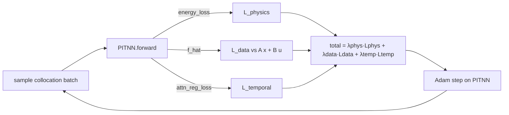
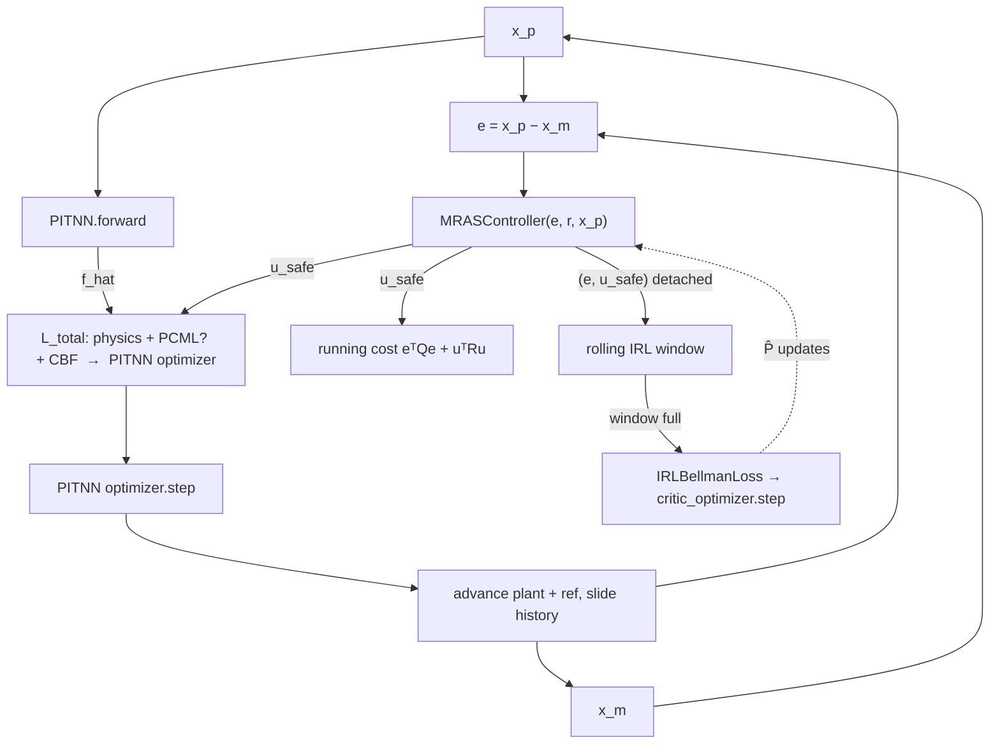
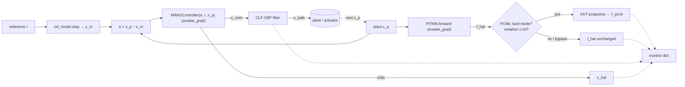
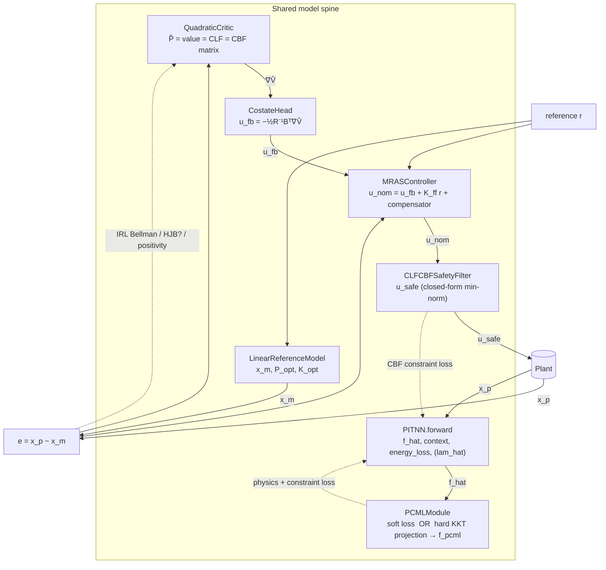

# PITS-MRAS — Data Flow

**Version**: 0.4.4 | **Last Updated**: 2026-06-04

This document traces how tensors move through the PITS-MRAS stack. Every shape,
dict key, loss term, and control-flow branch below is grounded in the source
under `src/pits_mras/`; line references point at the implementing file. For the
*static* module-import structure see
[`DEPENDENCY_GRAPH.md`](DEPENDENCY_GRAPH.md) (which carries the Mermaid module
diagram); this document is the *dynamic / runtime* counterpart.

---

## 0. Three data-flow regimes over one shared model stack

PITS-MRAS has **three distinct data-flow regimes**, all operating over the same
set of model objects (a `PITNN`, a `MRASController` wrapping a `QuadraticCritic`
+ `CostateHead` + `CLFCBFSafetyFilter`, a `LinearReferenceModel`, and an
optional `PCMLModule`):

1. **Pre-training** (`training/pretrain.py`) — open-loop, physics-first
   curriculum that warms up the `PITNN` on synthetic collocation points before
   any controller is in the loop.
2. **Co-training** (`training/cotrain.py`) — the closed-loop actor-critic loop:
   `PITNN` → controller → running cost → composite `L_total` → `PITNN` step,
   plus a *separate* IRL critic step and the optional `PCMLModule` constraint
   term.
3. **Real-time inference** (`inference/realtime.py`, `inference/parallel.py`) —
   the deployed 7-step control cycle under `@torch.no_grad()`, optionally
   hard-projecting the predicted dynamics through PCML.

The offline IRL critic trainer (`training/irl_trainer.py`) is a fourth, purely
*critic-fitting* path (batch least-squares on synthetic optimal trajectories);
it is summarized in §6.

Two model objects act as the shared "spine" across all regimes:

- The **`PITNN`** produces a dynamics prediction `f_hat` (and physics diagnostics).
- The **`QuadraticCritic`** (inside the controller) stores `P̂`, which is
  *simultaneously* the value-function matrix, the LQR/CLF matrix, and the CBF
  matrix — one `P̂` certifies optimality, stability, and safety.

---

## 1. The PITNN forward data flow

Source: `src/pits_mras/models/pitnn.py` (`PITNN.forward`, lines 101–165), with
sub-modules `models/attention.py` and `models/decoders.py`.

### 1.1 Inputs (six tensors)

`PITNN.forward(x_hist, u_hist, x_p_curr, u_curr, e_curr, e_hist)` — shapes as
declared in the signature (pitnn.py:101–109). Batch-first, `T` = history length:

| Argument    | Shape                  | Meaning                          |
|-------------|------------------------|----------------------------------|
| `x_hist`    | `[batch, T, input_dim]`| plant-state history              |
| `u_hist`    | `[batch, T, input_dim]`| control history                  |
| `x_p_curr`  | `[batch, input_dim]`   | current plant state              |
| `u_curr`    | `[batch, control_dim]` | current control                  |
| `e_curr`    | `[batch, e_dim]`       | current tracking error           |
| `e_hist`    | `[batch, T, e_dim]`    | tracking-error history           |

Dimensional conventions (pitnn.py `__init__`, 38–90): `output_dim == 2 * n_q`
(canonical `[q, p]` system), `n_q = phys_cfg.n_generalized_coords`, and control
enters through the momentum channel so the wired `control_dim == n_q`
(pitnn.py:73–80, 185).

### 1.2 Stage A — normalize + embed (pitnn.py:116–120)

1. `x_norm = normalize(x_hist)` using non-trainable running buffers `mu_x`,
   `sigma_x` (registered at pitnn.py:55–56; `normalize` is
   `(x - mu_x) / sigma_x`, pitnn.py:97–99).
2. `emb_state = embed_state(x_norm)` → `[batch, T, embedding_dim]`.
3. `emb_ctrl = embed_control(normalize(u_hist))` → `[batch, T, embedding_dim]`.
4. `seq = cat([emb_state, emb_ctrl], dim=-1)` → `[batch, T, 2*embedding_dim]`.

### 1.3 Stage B — causal LSTM encoder (pitnn.py:122–123)

`H_enc, _ = lstm(seq)` → `[batch, T, hidden_dim]`. The LSTM is **forward-only**
(`batch_first=True`, no `bidirectional`; pitnn.py:64–69) — this is the causality
guarantee: no future sample leaks into the current prediction.

A finite-difference velocity is then computed for the dissipation channel
(pitnn.py:125–130): `x_p_dot = (x_hist[:,-1] - x_hist[:,-2]) / 0.01` when
`T > 1`, else zeros — shape `[batch, input_dim]`.

### 1.4 Stage C — physics-informed attention (pitnn.py:132–135)

`context, alpha = attention(H_enc, e_hist, x_p_curr, e_curr, x_p_dot, u_curr)`.

`PhysicsInformedAttention` (attention.py:27–) fuses **three attention *types***
(not three heads — `n_heads` defaults to 4, attention.py:48) via a learned
3-way softmax gate (attention.py:68–70):

1. **Temporal** — scaled dot-product over LSTM hidden states (attention.py:84–88).
2. **Physical** — a learned score over the descriptor `[x_p, x_p_dot, u]`
   (size `2*n_state + control_dim`, attention.py:60, 65).
3. **Error-driven** — similarity between `e_curr` and each past `e_hist[t]`.

Outputs: `context` `[batch, hidden_dim]`, `alpha` `[batch, T]` (rows sum to 1).

### 1.5 Stage D — port-Hamiltonian decoder (pitnn.py:137–141; decoders.py:159–228)

The decoder slices the canonical state from `x_p_curr` (pitnn.py:138–140):
`q = x_p_curr[:, :n_q]`, `p = x_p_curr[:, n_q:2*n_q]`, `q_dot = x_p_dot[:, :n_q]`,
then calls `decoder(q, p, q_dot, u_curr, context)`.

Inside `PortHamiltonianDecoder.forward` (decoders.py:159–228):

```
f_hat = J(q) ∇H  −  [0; R_θ(q) (∂H/∂p)]  +  B(x_p) u  +  W_corr · c_t
        └ f_cons ┘   └──── f_diss ────┘    └ f_ctrl ┘   └─ f_corr ─┘
```

- `qp = cat([q,p]).requires_grad_(True)`; `H_val = H_net(q,p)` → `[batch,1]`
  with a `Softplus` head so `H > 0` (decoders.py:175–180, 44–64).
- `grad_H = autograd.grad(H_val.sum(), qp, create_graph=True)` →
  `[batch, 2*n_q]` (decoders.py:181–183). **This internal autograd call is why
  the inference engine must re-enable grad** (see §5).
- `J` is skew-symmetric (constant canonical `[[0,I],[-I,0]]` or learned
  `make_skew_symmetric(J_net(q))`; decoders.py:145–157).
- `R_θ(q) = LᵀL + εI ⪰ 0` (decoders.py:67–92, 199); damping acts against the
  Hamiltonian velocity `∂H/∂p` so `P_diss = (∂H/∂p)ᵀ R (∂H/∂p) ≥ 0`
  (decoders.py:200–202, 219–221).
- `energy_loss = port_hamiltonian_energy_loss(...) + hamiltonian_positivity_loss(...)`
  (decoders.py:223–227).

Decoder returns `(f_hat [batch,2*n_q], H_val [batch,1], P_diss [batch],
energy_loss scalar)`.

### 1.6 Output dict (pitnn.py:149–165)

`PITNN.forward` returns a `Dict[str, Tensor]`:

| Key             | Shape / type        | Source                                  |
|-----------------|---------------------|-----------------------------------------|
| `f_hat`         | `[batch, 2*n_q]`    | decoder dynamics prediction             |
| `H_val`         | `[batch, 1]`        | learned Hamiltonian energy              |
| `context`       | `[batch, hidden_dim]`| attention context `c_t`                |
| `alpha`         | `[batch, T]`        | combined attention weights              |
| `h_enc`         | `[batch, T, hidden_dim]` | LSTM hidden states                 |
| `P_diss`        | `[batch]`           | dissipated power                        |
| `energy_loss`   | scalar              | pH energy residual (the `L_physics`)    |
| `attn_reg_loss` | scalar              | attention regularization (the temporal term) |
| `lam_hat`       | `[batch, n_lambda]` | **only if** a `lagrangian_head` is set  |

`lam_hat` is emitted only when an optional `LagrangianMultiplierHead` was passed
to `__init__` (pitnn.py:49–52, 146–147, 163–164); otherwise the v0.2.0 output
contract is unchanged. It is the KKT warm-start multiplier consumed by PCML.

---

## 2. The PCML data flow

Source: `src/pits_mras/models/pcml.py`. PCML upgrades the *soft* port-Hamiltonian
regularizer into *provable* constraint satisfaction, with a **mode switch** at
threshold `eta`.

```
                      f_hat (from PITNN, the backbone prediction)
                        │
            ┌───────────┴────────────┐
   mode == "soft"              mode == "hard"  (after data loss < eta)
            │                           │
   SoftPCMLLoss: augmented        KKTProjectionLayer: project f_hat
   loss on residuals D/h/g         onto the DAE manifold (Newton + IFT)
            │                           │
   returns (y_hat unchanged,      returns (y_tilde = f_pcml,
            soft_loss, info)               hard_loss, info)
```

### 2.1 Mode switch (pcml.py:402–414)

`PCMLModule.update_activation(current_data_loss)` flips `_hard_mode_active` to
`True` the first time `current_data_loss < eta` (default `eta = 0.01`,
pcml.py:381, 407). `mode` reports `"soft"`/`"hard"` (pcml.py:412–414). The flip
is one-way.

### 2.2 Soft mode (pcml.py:35–82, 452–454)

`SoftPCMLLoss.forward(x, t, y_pred, d_pred)` returns
`(total, {diff, eq, ineq, violation})` where
`L = λ_diff·‖D‖² + λ_eq·‖h‖² + λ_ineq·‖ReLU(g)‖²` (pcml.py:62–82). In soft mode
`PCMLModule.forward` returns the **unconstrained** `y_hat` plus this soft loss
(pcml.py:452–454) — the prediction is *not* modified, only the loss is augmented.

### 2.3 Hard mode — KKT projection (pcml.py:133–354, 430–451)

`KKTProjectionLayer.forward(x, t, y_hat, d_hat, lam_hat)` solves the
minimum-distance projection onto the DAE manifold (pcml.py:320–354):

```
y_tilde, d_tilde = argmin ½‖y − y_hat‖²   s.t.  D=0,  h=0,  g ≤ 0
```

- Per-sample variable vector `z = [y, d, λ_eq, λ_ineq, s]`, residual `F`
  (pcml.py:151–157, 220–259), with `n_c = n_differential + n_equality`,
  `n_g = n_inequality`.
- `lam_hat` (from the PITNN's Lagrangian head, or zeros) **warm-starts**
  `z` (pcml.py:296–318).
- A detached Newton loop (`max_newton_iter`, `newton_tol`) solves the KKT
  system with Fischer–Burmeister complementarity for inequalities
  (pcml.py:327–336); a **single implicit-function-theorem step** at `z*` makes
  `∂y_tilde/∂y_hat` correct without unrolling (pcml.py:338–345).
- Returns `(y_tilde, d_tilde, lam_tilde)` (pcml.py:347–354). In hard mode
  `PCMLModule.forward` returns `y_tilde` as the constrained prediction `f_pcml`
  with loss `MSE(y_tilde, y_true) + ω·MSE(d_tilde, d_hat)` (pcml.py:430–451).

In every regime the constrained output is the projected `f_pcml`; the choice of
which `f` reaches the controller / monitor differs by regime (§4, §5).

---

## 3. The control data flow

Source: `src/pits_mras/controllers/`.

### 3.1 Reference model (reference_models.py)

`LinearReferenceModel` ($\dot x_m = A_m x_m + B_m r$, Hurwitz `A_m`) solves the
Lyapunov equation for `P` and runs Kleinman iteration for `(P_opt, K_opt)` at
construction (reference_models.py:69–90). `step(x_m, r, dt)` is forward-Euler:
`x_m + (x_m A_mᵀ + r B_mᵀ)·dt` → `[batch, n]` (reference_models.py:97–103). This
same `A_m` feeds both the value function (Identity 1) and the CBF (§3.3).

### 3.2 Controller forward (mras.py:94–132)

`MRASController.forward(e, r, x_plant, apply_safety=True)` computes the control
law `u = u_fb(e) + K_ff·r + compensator(x_plant)`, then optionally the CBF
filter:

```
e ──► costate_head(e) ──► (lambda_hat = ∇V̂,  u_fb = −½R⁻¹Bᵀ∇V̂ = −R⁻¹BᵀP̂e)
r ──► u_ff = r @ K_ffᵀ
x_plant ──► u_comp = compensator(x_plant)            (Linear→Tanh→Linear)
                    │
        u_nom = u_fb + u_ff + u_comp
                    │
       apply_safety? ──► CLFCBFSafetyFilter(e, u_nom) ──► u_safe
```

- `u_fb` is the **costate-head optimal control** (Identity 2): the action head
  *is* the autodiff gradient of the critic, `u_fb = −½R⁻¹Bᵀ∇V̂` (critic.py:188–198,
  mras.py:114). Because the critic is warm-started to `P_opt`
  (`critic.set_P(reference_model.P_opt)`, mras.py:58–60), `u_fb` equals the LQR
  feedback `−K_opt·e` at init and adapts as IRL learns `P̂`.
- `costate_head` calls `critic.gradient(e)` → `autograd.grad` internally
  (critic.py:75–84). **This is the second reason inference must re-enable grad**
  (§5).

Returned dict (mras.py:119–132): `u_nom`, `lambda_hat`, `v_hat = critic(e)`,
`u` (= `u_safe` if filtered else `u_nom`), and when the filter is active also
`h_cbf` and `slack`.

### 3.3 CLF-CBF safety filter (safety.py:61–92)

`CLFCBFSafetyFilter.forward(e, u_nom)` applies a closed-form, single-constraint
minimum-norm CBF projection (no QP solver). It reuses the *same* `P` as both the
CLF (`V = eᵀPe`) and the CBF (`h(e) = c − eᵀPe`):

- `h_e = safety_margin − eᵀPe` → `[batch]` (safety.py:74–75).
- Lie derivatives `L_f h = −2 eᵀP A_m e`, `L_g h = −2 eᵀP B` (safety.py:78–80).
- Safety index `a = L_f h + L_g h·u_nom + γ·h_e` (safety.py:82–84).
- Correction `u_safe = u_nom + (ReLU(−a)/‖L_g h‖²)·L_g h` — zero when `a ≥ 0`
  (safe), restoring forward invariance when `a < 0` (safety.py:86–91).

Returns `(u_safe [batch,m], h_e [batch], slack [batch])` where `slack` is the
correction norm (0 ⇒ filter inactive).

---

## 4. Pre-training data flow (3-stage curriculum)

Source: `src/pits_mras/training/pretrain.py` (`pretrain_pitnn`, lines 137–268).
Open-loop, no controller. Each epoch:

1. **Compute curriculum weights** (pretrain.py:202–209):
   - `lambda_data = data_weight_schedule(epoch, …)` (pretrain.py:55–68):
     **Stage 1A** (`epoch ≤ stage1_epochs`) → constant `0.1`; **Stage 1B**
     (next `stage2_epochs`) → cosine anneal `0.1 → 1.0`; **Stage 1C** → `1.0`.
   - `lambda_temp = temporal_weight_schedule(…)` (pretrain.py:71–89): `0.0`
     until Stage 1C, then **linear warm-up** to `lambda_temporal`.
2. **Sample collocation batch** uniformly in `[-1,1]` (pretrain.py:111–134,
   211–213) — the six `PITNN.forward` arguments.
3. **Build the data target** from a fixed stable linear surrogate
   `f(x,u) = A x + B u` (pretrain.py:92–108, 214) — Gap G7 (no external dataset).
4. **PITNN forward** (pretrain.py:216–223) → output dict.
5. **Assemble losses** (pretrain.py:224–245):
   - `L_physics = output["energy_loss"]` (the pH energy residual).
   - `L_data = mean((f_hat − f_target)²)`.
   - **Validation guard**: if `L_physics > epsilon_tol`, halve `lambda_data` and
     log a warning (pretrain.py:230–239).
   - `total = lambda_physics·L_physics + lambda_data·L_data`, plus
     `lambda_temp·L_temporal` (with `L_temporal = output["attn_reg_loss"]`) once
     in Stage 1C.
6. **Optimizer step** (Adam; pretrain.py:247–249) and append to the history dict
   (`total_loss`, `physics_loss`, `data_loss`, `temporal_loss`, `lambda_data`,
   `lambda_temp`; pretrain.py:251–256).



---

## 5. Co-training data flow (closed-loop actor-critic + IRL)

Source: `src/pits_mras/training/cotrain.py` (`cotraining_loop`, lines 81–331).
For each episode/step (cotrain.py:183–319):

1. **Tracking error & PITNN forward** (cotrain.py:198–204):
   `e_state = x_p − x_m`; `e_curr = e_state[:, :output_dim]`; then
   `pitnn(x_hist, u_hist, x_p, u_curr, e_curr, e_hist)`.
2. **Controller** acts on the reduced error `e = e_state[:, :state_dim]`
   (cotrain.py:207–209): `controller(e, r, x_p, apply_safety=use_cbf)` →
   `u_safe = controller_output["u"]`.
3. **Running cost** `r(e,u) = eᵀQe + uᵀRu` computed inline (cotrain.py:211–214).
4. **PITNN objective `L_total`** (cotrain.py:216–270), summed term by term:
   - physics: `L_phys = mean((f_hat[:, :state_dim] − (A_m e + B_m u_safe.detach()))²)`
     weighted by `lambda_physics` (cotrain.py:217–221);
   - **optional PCML** (cotrain.py:223–243): `update_activation(L_phys)` then
     `pcml_module(zeros_xt, zeros_xt, y_hat=f_hat[:, :n_out], d_hat=zeros,
     lam_hat=out.get("lam_hat", zeros), y_true=f_target[:, :n_out])`; adds
     `lambda_pcml·l_pcml`. `x/t/d` are zeros (the synthetic plant has no
     spatial/temporal coords) — the residual is evaluated on `f_hat`;
   - CBF constraint `0.1·cbf_constraint_loss(e, u_safe)` if `use_cbf`.
   `L_total` is a **pure PITNN objective** — the critic-only regularizers (HJB,
   positivity) are NOT in it (v0.4.0; previously their gradients landed on the
   critic's `W_c` and were discarded).
5. **PITNN step** `l_total.backward(); optimizer_pitnn.step()`.
6. **Critic-only updates on the separate `critic_optimizer`** (Adam lr=1e-3),
   each a fresh `zero_grad`/`backward`/`step`:
   - **opt-in HJB residual** — when `lambda_hjb>0`: `lambda_hjb·hjb_loss(critic,
     e.detach())` (a genuine gradient step every iteration);
   - **guarded positivity** — when `min_eig(P̂)<0`: `1e-3·positivity_loss()`
     (a no-op while `P̂` is PD, so it doesn't advance the Adam step count);
   - **IRL Bellman step** — push detached `(e, u_safe)` into rolling deques; once
     the window holds `irl_window + 1` samples, form `IRLBellmanLoss(critic,
     e_win, u_win, dt)`, backward, grad-clip to 1.0, step. Then the
     **policy-improvement read-out** `K = R⁻¹BᵀP̂` is computed for diagnostics
     only — the effective feedback already lives in the costate head. The IRL
     step is taken AFTER the PITNN step so the in-place critic update cannot
     invalidate the `L_total` graph.
7. **Advance plant + reference, slide history**:
   `x_p = _synthetic_plant_step(x_p, u_full, A_m, B_m, dt)` (detached),
   `x_m = ref_model.step(x_m, r, dt)`, and the three history windows are rolled.

Metrics dict per step: `irl_loss`, `hjb_loss`,
`positivity_loss`, `cbf_loss`, `total_loss`, `running_cost`
(plus `pcml_loss` when a `pcml_module` is supplied).



---

## 6. Offline IRL critic trainer (batch least-squares)

Source: `src/pits_mras/training/irl_trainer.py` (`train_irl_critic`, 166–227).
A standalone critic-fitting path used to warm-start `P̂` before co-training:

1. Roll out optimal closed-loop error trajectories `ė = (A_m − B_m K_opt) e`
   with running cost and `u = −K_opt e` (irl_trainer.py:91–124).
2. Build the IRL Bellman least-squares system `Φ p = y`: each window row is
   `φ(e_t) − φ(e_{t+W})`, target the trapezoidal cost integral over the window
   (irl_trainer.py:127–163), `φ` the quadratic feature map (irl_trainer.py:46–68).
3. Iterate `torch.linalg.lstsq`, write `P̂` back via `critic.set_P`, stop when
   `‖P̂ − P_opt‖/‖P_opt‖ < tol` (irl_trainer.py:214–227). Returns
   `(P_hat, converged, n_iters)`.

For consistent optimal-trajectory data this recovers `P_opt` exactly.

---

## 7. Real-time inference data flow (the 7-step closed loop)

Source: `src/pits_mras/inference/realtime.py` (`RealtimeInferenceEngine.step`,
lines 90–204). The whole `step` is decorated `@torch.no_grad()` and guarded by a
`threading.Lock` (realtime.py:85, 90, 107).

**Inputs**: `x_p [state_dim]`, `r [ref_dim]`, `dt`. **Returns** the monitoring
dict `{u_safe, e, v_hat, h_cbf, f_hat, cbf_active, pcml_violation}`
(realtime.py:196–204).

1. **Measure plant state** `x_p` (moved to device; realtime.py:104).
2. **Lazy init** on the first call (realtime.py:107–117): seed `x_m = x_p`, fill
   the bounded `deque` history buffers (`maxlen=horizon`) so the first PITNN
   forward sees a full window.
3. **Reference-model step + tracking error** (realtime.py:124–128):
   `x_m = ref_model.step(x_m, r, dt)`; `e = x_p − x_m` (canonical `C_p = I`).
4. **PITNN forward** under `with torch.enable_grad()` (realtime.py:130–146):
   builds `[1, T, dim]` history tensors, calls the real six-arg signature, then
   `f_hat = pitnn_out["f_hat"].detach().squeeze(0)`.
5. **Optional PCML hard projection** of `f_hat` (realtime.py:148–167): only when
   `pcml_module.mode == "hard"`. Compute `violation`; **DAE-HardNet §4.8
   inference bypass** — skip the projection when `violation <
   pcml_projection_tolerance`. Otherwise run `mod.projection(...)` (again under
   `enable_grad`) and overwrite the first `n_out` entries of `f_hat` with the
   detached projection.
6. **Controller forward** under `with torch.enable_grad()` (realtime.py:169–177):
   `controller(e, r, x_p)`; `u_safe = ctrl_out["u"].detach().squeeze(0)`. CBF
   activation derived from `ctrl_out["slack"] > 1e-4` (realtime.py:179–186);
   `v_hat = controller.critic(e)` computed here because the controller does not
   return it (realtime.py:188–189).
7. **Update bounded history** with the applied `u_safe` and return the dict
   (realtime.py:191–204).

### 7.1 The grad / no_grad handling (the critical detail)

The engine runs under `@torch.no_grad()` for speed, **but two sub-modules need a
live autograd graph internally**: the port-Hamiltonian decoder's `∇H`
(decoders.py:181, `create_graph=True`) and the costate head's `∇V̂`
(critic.py:83). Under `no_grad`, `requires_grad_` is a silent no-op, which would
break both gradients. The engine therefore wraps *exactly* the PITNN forward, the
PCML projection, and the controller call in `with torch.enable_grad()` and
`.detach()`es every result, so **no training graph escapes the step**
(realtime.py:130–146, 164–165, 169–177). This is documented inline at
realtime.py:18–21 and 130–135.

### 7.2 Parallel deployment topology

Source: `src/pits_mras/inference/parallel.py` (`ParallelInferenceEngine`). A
three-thread skeleton around one `RealtimeInferenceEngine`:

- **`ControlThread`** (~1 kHz, parallel.py:93–106): calls `engine.step` under
  `_critic_lock`, publishes `u_safe`/`e_norm`/`v_hat`/`h_cbf`/`cbf_active` into
  the lock-protected `ControllerState`. Never blocks on adaptation.
- **`AdaptationThread`** (~100 Hz, parallel.py:108–117): double-buffer pattern —
  `copy.deepcopy` the critic, update the copy, atomically swap it back under
  `_critic_lock` (the IRL update itself is a placeholder here, parallel.py:18–23).
- **`MonitorThread`** (~10 Hz, parallel.py:119–126): snapshots the CBF-activation
  rate from the shared state.

Shutdown is a single `threading.Event`; `stop()` is idempotent (parallel.py:153–158).



---

## 8. End-to-end runtime data flow (all regimes)

The diagram below stitches the shared spine: `PITNN → (PCML) → controller → CBF
→ plant → reference model → error → back`. In **inference** the plant is a real
actuator/sensor; in **co-training** it is the synthetic `_synthetic_plant_step`.
The dashed IRL/PITNN edges are the learning loops that mutate `P̂` and the PITNN
weights respectively.



> The module-import (static) view of these same components is in
> [`DEPENDENCY_GRAPH.md`](DEPENDENCY_GRAPH.md) §"Visual Dependency Graph"; this
> document is the tensor-flow (dynamic) view.

---

## 9. Cross-regime invariants

- **One `P̂` everywhere.** `QuadraticCritic.P̂` is the value-function matrix
  (Identity 1), the costate source (Identity 2), the CLF matrix, and the CBF
  matrix (Identity 3) — set once via `set_P` and adapted by IRL. The CBF filter
  is built from `critic.extract_P()` (mras.py:85–86).
- **Causality.** The forward-only LSTM (pitnn.py:64–69) means no future data
  influences `f_hat`, in training or deployment.
- **Energy structure by construction.** `J = −Jᵀ`, `R_θ ⪰ 0`, `H > 0`
  (decoders.py); the pH energy residual cancels analytically for the
  conservative/dissipative/control terms, leaving only the learned `f_corr`.
- **Constraint enforcement escalates.** Soft PCML in early
  pre-/co-training → hard KKT projection once the data loss drops below `eta`
  (pcml.py:402–414) → inference-time bypass when the live violation is already
  below tolerance (realtime.py:154–167).
- **`@torch.no_grad()` + scoped `enable_grad()`** is the deployment contract:
  internal `autograd.grad` calls (decoder `∇H`, costate `∇V̂`) are kept alive
  only inside the narrowly scoped `enable_grad` blocks, and every tensor leaving
  the step is detached (realtime.py:130–177).
