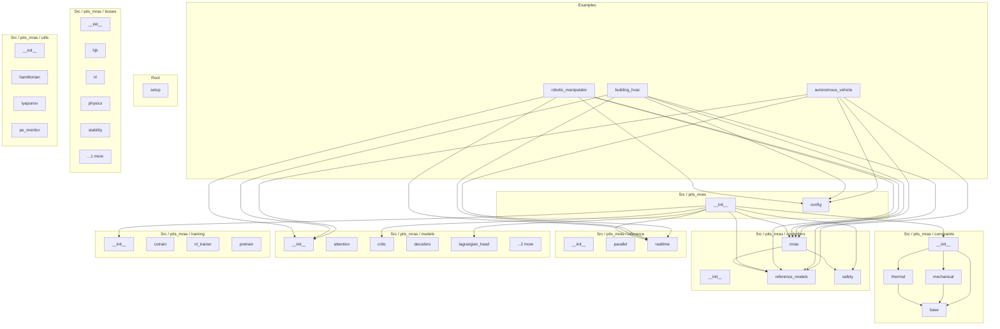

# pits_mras - Dependency Graph

**Version**: 0.3.0 | **Last Updated**: 2026-06-02

Comprehensive dependency graph of all Python modules, imports, exports, functions, classes, and constants in the codebase.

---

## Overview

The codebase is organized into the following modules:

- **examples**: 3 files
- **root**: 1 file
- **src/pits_mras**: 2 files
- **src/pits_mras/constraints**: 4 files
- **src/pits_mras/controllers**: 4 files
- **src/pits_mras/inference**: 3 files
- **src/pits_mras/losses**: 6 files
- **src/pits_mras/models**: 7 files
- **src/pits_mras/training**: 4 files
- **src/pits_mras/utils**: 4 files

---

## Examples Dependencies

### `examples/autonomous_vehicle.py` - Example: autonomous vehicle lateral control (IP §10.2).

**Third-party Dependencies:**
| Package | Import |
|---------|--------|
| `numpy` | `(module)` |
| `torch` | `(module)` |
| `torch` | `(module)` |
| `matplotlib` | `(module)` |
| `matplotlib.pyplot` | `(module)` |

**Standard-library Dependencies:**
| Module | Import |
|--------|--------|
| `__future__` | `annotations` |
| `math` | `(module)` |
| `typing` | `Any` |

**Internal Dependencies:**
| Module | Imports | Type |
|--------|---------|------|
| `src/pits_mras/config.py` | `NetworkConfig, PhysicsConfig, PITSMRASConfig` | Import |
| `src/pits_mras/controllers/mras.py` | `MRASController` | Import |
| `src/pits_mras/controllers/reference_models.py` | `LinearReferenceModel` | Import |
| `src/pits_mras/inference/realtime.py` | `RealtimeInferenceEngine` | Import |
| `src/pits_mras/models/__init__.py` | `PITNN` | Import |

**Exports:**
- Functions: `run`, `main`

---

### `examples/building_hvac.py` - Example: building HVAC thermal-zone control (IP §10.3).

**Third-party Dependencies:**
| Package | Import |
|---------|--------|
| `numpy` | `(module)` |
| `torch` | `(module)` |
| `matplotlib` | `(module)` |
| `matplotlib.pyplot` | `(module)` |

**Standard-library Dependencies:**
| Module | Import |
|--------|--------|
| `__future__` | `annotations` |
| `math` | `(module)` |
| `typing` | `Any` |

**Internal Dependencies:**
| Module | Imports | Type |
|--------|---------|------|
| `src/pits_mras/config.py` | `NetworkConfig, PhysicsConfig, PITSMRASConfig` | Import |
| `src/pits_mras/controllers/mras.py` | `MRASController` | Import |
| `src/pits_mras/controllers/reference_models.py` | `LinearReferenceModel` | Import |
| `src/pits_mras/inference/realtime.py` | `RealtimeInferenceEngine` | Import |
| `src/pits_mras/models/__init__.py` | `PITNN` | Import |

**Exports:**
- Functions: `run`, `main`

---

### `examples/robotic_manipulator.py` - Example: 2-DOF planar robotic manipulator (IP §10.1).

**Third-party Dependencies:**
| Package | Import |
|---------|--------|
| `matplotlib` | `(module)` |
| `numpy` | `(module)` |
| `torch` | `(module)` |
| `matplotlib.pyplot` | `(module)` |

**Standard-library Dependencies:**
| Module | Import |
|--------|--------|
| `__future__` | `annotations` |
| `math` | `(module)` |
| `typing` | `Any` |

**Internal Dependencies:**
| Module | Imports | Type |
|--------|---------|------|
| `src/pits_mras/config.py` | `NetworkConfig, PhysicsConfig, PITSMRASConfig` | Import |
| `src/pits_mras/controllers/mras.py` | `MRASController` | Import |
| `src/pits_mras/controllers/reference_models.py` | `LinearReferenceModel` | Import |
| `src/pits_mras/inference/realtime.py` | `RealtimeInferenceEngine` | Import |
| `src/pits_mras/models/__init__.py` | `PITNN` | Import |

**Exports:**
- Functions: `run`, `main`

---

## Root Dependencies

### `setup.py` - setup module

**Third-party Dependencies:**
| Package | Import |
|---------|--------|
| `setuptools` | `find_packages, setup` |

---

## Src / pits_mras Dependencies

### `src/pits_mras/__init__.py` - PITS-MRAS: Physics-Informed Time-Series Model-Reference Adaptive Systems.

**Internal Dependencies:**
| Module | Imports | Type |
|--------|---------|------|
| `src/pits_mras/constraints/__init__.py` | `ConstraintSpec, HeatConductionDAE, MechanicalDAE, PhysicsConstraints` | Re-export |
| `src/pits_mras/controllers/mras.py` | `MRASController` | Re-export |
| `src/pits_mras/controllers/reference_models.py` | `LinearReferenceModel` | Re-export |
| `src/pits_mras/controllers/safety.py` | `CLFCBFSafetyFilter` | Re-export |
| `src/pits_mras/inference/realtime.py` | `RealtimeInferenceEngine` | Re-export |
| `src/pits_mras/models/critic.py` | `QuadraticCritic` | Re-export |
| `src/pits_mras/models/lagrangian_head.py` | `LagrangianMultiplierHead` | Re-export |
| `src/pits_mras/models/pcml.py` | `KKTProjectionLayer, PCMLModule, SoftPCMLLoss, TaylorNeighborhoodApproximation` | Re-export |
| `src/pits_mras/models/pitnn.py` | `PITNN` | Re-export |
| `src/pits_mras/training/__init__.py` | `cotraining_loop, pretrain_pitnn` | Re-export |

**Exports:**
- Re-exports: `ConstraintSpec`, `HeatConductionDAE`, `MechanicalDAE`, `PhysicsConstraints`, `MRASController`, `LinearReferenceModel`, `CLFCBFSafetyFilter`, `RealtimeInferenceEngine`, `QuadraticCritic`, `LagrangianMultiplierHead`, `KKTProjectionLayer`, `PCMLModule`, `SoftPCMLLoss`, `TaylorNeighborhoodApproximation`, `PITNN`, `cotraining_loop`, `pretrain_pitnn`

---

### `src/pits_mras/config.py` - Centralized configuration for PITS-MRAS (IP §4.2).

**Third-party Dependencies:**
| Package | Import |
|---------|--------|
| `torch` | `(module)` |
| `yaml` | `(module)` |

**Standard-library Dependencies:**
| Module | Import |
|--------|--------|
| `dataclasses` | `(module)` |
| `dataclasses` | `dataclass, field` |
| `typing` | `List, Optional` |

**Exports:**
- Classes: `NetworkConfig`, `PhysicsConfig`, `MRASConfig`, `SafetyConfig`, `LossConfig`, `TrainingConfig`, `PCMLConfig`, `PITSMRASConfig`

---

## Src / pits_mras / constraints Dependencies

### `src/pits_mras/constraints/__init__.py` - Physics constraint systems for PCML (PCML Addendum §2.1).

**Internal Dependencies:**
| Module | Imports | Type |
|--------|---------|------|
| `src/pits_mras/constraints/base.py` | `ConstraintSpec, PhysicsConstraints` | Re-export |
| `src/pits_mras/constraints/mechanical.py` | `MechanicalDAE` | Re-export |
| `src/pits_mras/constraints/thermal.py` | `HeatConductionDAE` | Re-export |

**Exports:**
- Re-exports: `ConstraintSpec`, `PhysicsConstraints`, `MechanicalDAE`, `HeatConductionDAE`

---

### `src/pits_mras/constraints/base.py` - Base classes for physics constraint specifications (PCML Addendum §2.1).

**Third-party Dependencies:**
| Package | Import |
|---------|--------|
| `torch` | `Tensor` |

**Standard-library Dependencies:**
| Module | Import |
|--------|--------|
| `abc` | `ABC, abstractmethod` |
| `dataclasses` | `dataclass` |

**Exports:**
- Classes: `ConstraintSpec`
- Protocols/ABCs: `PhysicsConstraints`

---

### `src/pits_mras/constraints/mechanical.py` - Mechanical-system constraints: Euler-Lagrange DAEs (PCML Addendum §2.1).

**Third-party Dependencies:**
| Package | Import |
|---------|--------|
| `torch` | `(module)` |
| `torch` | `Tensor` |

**Standard-library Dependencies:**
| Module | Import |
|--------|--------|
| `typing` | `Callable, Optional, Tuple` |

**Internal Dependencies:**
| Module | Imports | Type |
|--------|---------|------|
| `src/pits_mras/constraints/base.py` | `ConstraintSpec, PhysicsConstraints` | Import |

**Exports:**
- Classes: `MechanicalDAE`

---

### `src/pits_mras/constraints/thermal.py` - Thermal-system constraints for HVAC / heat conduction (PCML Addendum §2.1).

**Third-party Dependencies:**
| Package | Import |
|---------|--------|
| `torch` | `(module)` |
| `torch` | `Tensor` |

**Internal Dependencies:**
| Module | Imports | Type |
|--------|---------|------|
| `src/pits_mras/constraints/base.py` | `ConstraintSpec, PhysicsConstraints` | Import |

**Exports:**
- Classes: `HeatConductionDAE`

---

## Src / pits_mras / controllers Dependencies

### `src/pits_mras/controllers/__init__.py` - Controllers subpackage: reference models, CLF-CBF safety filter, MRAS actor.

---

### `src/pits_mras/controllers/mras.py` - Actor-critic MRAS controller (IP §7.3). Identities 1, 2, 3, 4.

**Third-party Dependencies:**
| Package | Import |
|---------|--------|
| `torch` | `(module)` |
| `torch.nn` | `(module)` |
| `torch` | `Tensor` |

**Standard-library Dependencies:**
| Module | Import |
|--------|--------|
| `typing` | `Dict, Optional, Tuple` |

**Internal Dependencies:**
| Module | Imports | Type |
|--------|---------|------|
| `src/pits_mras/controllers/reference_models.py` | `LinearReferenceModel` | Import |
| `src/pits_mras/controllers/safety.py` | `CLFCBFSafetyFilter` | Import |
| `src/pits_mras/models/critic.py` | `CostateHead, QuadraticCritic` | Import |
| `src/pits_mras/utils/lyapunov.py` | `solve_care` | Import |

**Exports:**
- Classes: `MRASController`

---

### `src/pits_mras/controllers/reference_models.py` - Linear reference model (IP §7.1).

**Third-party Dependencies:**
| Package | Import |
|---------|--------|
| `numpy` | `(module)` |
| `torch` | `(module)` |
| `torch.nn` | `(module)` |
| `torch` | `Tensor` |

**Internal Dependencies:**
| Module | Imports | Type |
|--------|---------|------|
| `src/pits_mras/utils/lyapunov.py` | `check_hurwitz, kleinman_iteration, solve_lyapunov` | Import |

**Exports:**
- Classes: `LinearReferenceModel`

---

### `src/pits_mras/controllers/safety.py` - CLF-CBF-QP safety filter (IP §7.2 / §3.4). NEW -- Identity 3.

**Third-party Dependencies:**
| Package | Import |
|---------|--------|
| `torch.nn` | `(module)` |
| `torch.nn.functional` | `(module)` |
| `torch` | `Tensor` |

**Standard-library Dependencies:**
| Module | Import |
|--------|--------|
| `typing` | `Tuple` |

**Exports:**
- Classes: `CLFCBFSafetyFilter`

---

## Src / pits_mras / inference Dependencies

### `src/pits_mras/inference/__init__.py` - Inference subpackage: real-time engine and parallel thread architecture.

---

### `src/pits_mras/inference/parallel.py` - Parallel thread architecture for deployment (IP §9.2).

**Third-party Dependencies:**
| Package | Import |
|---------|--------|
| `torch` | `Tensor` |

**Standard-library Dependencies:**
| Module | Import |
|--------|--------|
| `copy` | `(module)` |
| `threading` | `(module)` |
| `time` | `(module)` |
| `dataclasses` | `dataclass` |
| `typing` | `List, Optional` |

**Internal Dependencies:**
| Module | Imports | Type |
|--------|---------|------|
| `src/pits_mras/inference/realtime.py` | `RealtimeInferenceEngine` | Import |

**Exports:**
- Classes: `ControllerState`, `ParallelInferenceEngine`

---

### `src/pits_mras/inference/realtime.py` - Real-time closed-loop inference engine (IP §9.1).

**Third-party Dependencies:**
| Package | Import |
|---------|--------|
| `torch` | `(module)` |
| `torch` | `Tensor` |

**Standard-library Dependencies:**
| Module | Import |
|--------|--------|
| `threading` | `(module)` |
| `collections` | `deque` |
| `typing` | `TYPE_CHECKING, Any, Deque, Dict, Optional` |

**Internal Dependencies:**
| Module | Imports | Type |
|--------|---------|------|
| `src/pits_mras/controllers/mras.py` | `MRASController` | Import |
| `src/pits_mras/controllers/reference_models.py` | `LinearReferenceModel` | Import |
| `src/pits_mras/models/pitnn.py` | `PITNN` | Import |
| `src/pits_mras/models/pcml.py` | `PCMLModule` | Import (TYPE_CHECKING) |

**Exports:**
- Classes: `RealtimeInferenceEngine`

---

## Src / pits_mras / losses Dependencies

### `src/pits_mras/losses/__init__.py` - Loss functions for PITS-MRAS (Phase 3).

**Third-party Dependencies:**
| Package | Import |
|---------|--------|
| `torch` | `(module)` |
| `torch.nn` | `(module)` |

**Standard-library Dependencies:**
| Module | Import |
|--------|--------|
| `__future__` | `annotations` |

**Internal Dependencies:**
| Module | Imports | Type |
|--------|---------|------|
| `src/pits_mras/config.py` | `LossConfig` | Re-export |
| `src/pits_mras/losses/hjb.py` | `HJBResidualLoss, LyapunovDecreaseEnforcer` | Re-export |
| `src/pits_mras/losses/irl.py` | `IRLBellmanAccumulator, IRLBellmanLoss` | Re-export |
| `src/pits_mras/losses/physics.py` | `PhysicsLoss` | Re-export |
| `src/pits_mras/losses/stability.py` | `ControlEffortLoss, LyapunovConstraintLoss, MRASStabilityLoss, ParameterBoundednessLoss` | Re-export |
| `src/pits_mras/losses/temporal.py` | `AttentionRegularizationLoss, MultiStepPredictionLoss, TemporalLoss, TemporalSmoothnessLoss` | Re-export |

**Exports:**
- Classes: `TotalLoss`
- Re-exports: `LossConfig`, `HJBResidualLoss`, `LyapunovDecreaseEnforcer`, `IRLBellmanAccumulator`, `IRLBellmanLoss`, `PhysicsLoss`, `ControlEffortLoss`, `LyapunovConstraintLoss`, `MRASStabilityLoss`, `ParameterBoundednessLoss`, `AttentionRegularizationLoss`, `MultiStepPredictionLoss`, `TemporalLoss`, `TemporalSmoothnessLoss`

---

### `src/pits_mras/losses/hjb.py` - HJB residual loss (Phase 3).

**Third-party Dependencies:**
| Package | Import |
|---------|--------|
| `torch` | `(module)` |
| `torch.nn` | `(module)` |

**Standard-library Dependencies:**
| Module | Import |
|--------|--------|
| `__future__` | `annotations` |

**Internal Dependencies:**
| Module | Imports | Type |
|--------|---------|------|
| `src/pits_mras/models/critic.py` | `QuadraticCritic` | Import |

**Exports:**
- Classes: `HJBResidualLoss`, `LyapunovDecreaseEnforcer`

---

### `src/pits_mras/losses/irl.py` - Inverse-RL Bellman residual loss (Phase 3).

**Third-party Dependencies:**
| Package | Import |
|---------|--------|
| `torch` | `(module)` |
| `torch.nn` | `(module)` |

**Standard-library Dependencies:**
| Module | Import |
|--------|--------|
| `__future__` | `annotations` |

**Internal Dependencies:**
| Module | Imports | Type |
|--------|---------|------|
| `src/pits_mras/models/critic.py` | `QuadraticCritic` | Import |

**Exports:**
- Classes: `IRLBellmanAccumulator`, `IRLBellmanLoss`

---

### `src/pits_mras/losses/physics.py` - Physics-informed loss (Phase 3).

**Third-party Dependencies:**
| Package | Import |
|---------|--------|
| `torch` | `(module)` |
| `torch.nn` | `(module)` |

**Standard-library Dependencies:**
| Module | Import |
|--------|--------|
| `__future__` | `annotations` |

**Exports:**
- Classes: `PhysicsLoss`

---

### `src/pits_mras/losses/stability.py` - Stability-constraint losses (Phase 3).

**Third-party Dependencies:**
| Package | Import |
|---------|--------|
| `torch` | `(module)` |
| `torch.nn` | `(module)` |

**Standard-library Dependencies:**
| Module | Import |
|--------|--------|
| `__future__` | `annotations` |
| `typing` | `Iterable` |

**Exports:**
- Classes: `LyapunovConstraintLoss`, `ParameterBoundednessLoss`, `ControlEffortLoss`, `MRASStabilityLoss`

---

### `src/pits_mras/losses/temporal.py` - Temporal / multi-step prediction loss (Phase 3).

**Third-party Dependencies:**
| Package | Import |
|---------|--------|
| `torch` | `(module)` |
| `torch.nn` | `(module)` |

**Standard-library Dependencies:**
| Module | Import |
|--------|--------|
| `__future__` | `annotations` |

**Exports:**
- Classes: `MultiStepPredictionLoss`, `TemporalSmoothnessLoss`, `AttentionRegularizationLoss`, `TemporalLoss`

---

## Src / pits_mras / models Dependencies

### `src/pits_mras/models/__init__.py` - Models subpackage: attention, port-Hamiltonian decoders, critic/costate, PITNN.

**Internal Dependencies:**
| Module | Imports | Type |
|--------|---------|------|
| `src/pits_mras/models/attention.py` | `PhysicsInformedAttention` | Re-export |
| `src/pits_mras/models/critic.py` | `CostateHead, QuadraticCritic` | Re-export |
| `src/pits_mras/models/decoders.py` | `DissipationNet, HamiltonianNet, PortHamiltonianDecoder` | Re-export |
| `src/pits_mras/models/pitnn.py` | `PITNN` | Re-export |

**Exports:**
- Re-exports: `PhysicsInformedAttention`, `CostateHead`, `QuadraticCritic`, `DissipationNet`, `HamiltonianNet`, `PortHamiltonianDecoder`, `PITNN`

---

### `src/pits_mras/models/attention.py` - Multi-head physics-informed attention (IP §5.1).

**Third-party Dependencies:**
| Package | Import |
|---------|--------|
| `torch` | `(module)` |
| `torch.nn` | `(module)` |
| `torch.nn.functional` | `(module)` |
| `torch` | `Tensor` |

**Standard-library Dependencies:**
| Module | Import |
|--------|--------|
| `math` | `(module)` |

**Exports:**
- Classes: `PhysicsInformedAttention`

---

### `src/pits_mras/models/critic.py` - Critic / value network and costate head (IP §5.3). NEW -- Identity 1 & 2.

**Third-party Dependencies:**
| Package | Import |
|---------|--------|
| `torch` | `(module)` |
| `torch.nn` | `(module)` |
| `torch` | `Tensor` |

**Internal Dependencies:**
| Module | Imports | Type |
|--------|---------|------|
| `src/pits_mras/utils/lyapunov.py` | `quadratic_basis` | Import |

**Exports:**
- Classes: `QuadraticCritic`, `CostateHead`

---

### `src/pits_mras/models/decoders.py` - Port-Hamiltonian decoders (IP §5.2).

**Third-party Dependencies:**
| Package | Import |
|---------|--------|
| `torch` | `(module)` |
| `torch.nn` | `(module)` |
| `torch.nn.functional` | `(module)` |
| `torch` | `Tensor` |

**Internal Dependencies:**
| Module | Imports | Type |
|--------|---------|------|
| `src/pits_mras/utils/hamiltonian.py` | `hamiltonian_positivity_loss, make_positive_definite, make_skew_symmetric, port_hamiltonian_energy_loss` | Import |

**Exports:**
- Classes: `HamiltonianNet`, `DissipationNet`, `PortHamiltonianDecoder`

---

### `src/pits_mras/models/lagrangian_head.py` - Lagrangian-multiplier head for the KKT projection (PCML Addendum §2.3).

**Third-party Dependencies:**
| Package | Import |
|---------|--------|
| `torch` | `(module)` |
| `torch.nn` | `(module)` |
| `torch` | `Tensor` |

**Exports:**
- Classes: `LagrangianMultiplierHead`

---

### `src/pits_mras/models/pcml.py` - Physics-Constrained Machine Learning (PCML) module for PITS-MRAS.

**Third-party Dependencies:**
| Package | Import |
|---------|--------|
| `torch` | `(module)` |
| `torch.nn` | `(module)` |
| `torch.nn.functional` | `(module)` |
| `torch` | `Tensor` |

**Standard-library Dependencies:**
| Module | Import |
|--------|--------|
| `typing` | `Dict, List, Optional, Tuple` |

**Internal Dependencies:**
| Module | Imports | Type |
|--------|---------|------|
| `src/pits_mras/constraints/base.py` | `PhysicsConstraints` | Import |

**Exports:**
- Classes: `SoftPCMLLoss`, `TaylorNeighborhoodApproximation`, `KKTProjectionLayer`, `PCMLModule`

---

### `src/pits_mras/models/pitnn.py` - Top-level physics-informed time-series network -- PITNN (IP §5.4).

**Third-party Dependencies:**
| Package | Import |
|---------|--------|
| `torch` | `(module)` |
| `torch.nn` | `(module)` |
| `torch` | `Tensor` |

**Standard-library Dependencies:**
| Module | Import |
|--------|--------|
| `typing` | `Dict, Optional` |

**Internal Dependencies:**
| Module | Imports | Type |
|--------|---------|------|
| `src/pits_mras/config.py` | `NetworkConfig, PhysicsConfig` | Import |
| `src/pits_mras/models/attention.py` | `PhysicsInformedAttention` | Import |
| `src/pits_mras/models/decoders.py` | `PortHamiltonianDecoder` | Import |

**Exports:**
- Classes: `PITNN`

---

## Src / pits_mras / training Dependencies

### `src/pits_mras/training/__init__.py` - Training subpackage: physics pretrain, IRL co-train, offline IRL trainer.

**Internal Dependencies:**
| Module | Imports | Type |
|--------|---------|------|
| `src/pits_mras/training/cotrain.py` | `cotraining_loop` | Re-export |
| `src/pits_mras/training/irl_trainer.py` | `train_irl_critic` | Re-export |
| `src/pits_mras/training/pretrain.py` | `pretrain_pitnn` | Re-export |

**Exports:**
- Re-exports: `cotraining_loop`, `train_irl_critic`, `pretrain_pitnn`

---

### `src/pits_mras/training/cotrain.py` - Co-training pipeline with IRL critic updates (Algorithm 3 extended, §8.2).

**Third-party Dependencies:**
| Package | Import |
|---------|--------|
| `torch` | `(module)` |
| `torch` | `Tensor` |

**Standard-library Dependencies:**
| Module | Import |
|--------|--------|
| `__future__` | `annotations` |
| `logging` | `(module)` |
| `collections` | `deque` |
| `typing` | `TYPE_CHECKING, Deque` |

**Internal Dependencies:**
| Module | Imports | Type |
|--------|---------|------|
| `src/pits_mras/losses/hjb.py` | `HJBResidualLoss` | Import |
| `src/pits_mras/losses/irl.py` | `IRLBellmanLoss` | Import |
| `src/pits_mras/config.py` | `PITSMRASConfig` | Import (TYPE_CHECKING) |
| `src/pits_mras/controllers/mras.py` | `MRASController` | Import (TYPE_CHECKING) |
| `src/pits_mras/controllers/reference_models.py` | `LinearReferenceModel` | Import (TYPE_CHECKING) |
| `src/pits_mras/models/__init__.py` | `PITNN` | Import (TYPE_CHECKING) |
| `src/pits_mras/models/pcml.py` | `PCMLModule` | Import (TYPE_CHECKING) |

**Exports:**
- Functions: `cotraining_loop`

---

### `src/pits_mras/training/irl_trainer.py` - Offline IRL critic trainer (batch least-squares, §8.3).

**Third-party Dependencies:**
| Package | Import |
|---------|--------|
| `torch` | `(module)` |
| `torch` | `Tensor` |

**Standard-library Dependencies:**
| Module | Import |
|--------|--------|
| `__future__` | `annotations` |
| `logging` | `(module)` |
| `typing` | `TYPE_CHECKING` |

**Internal Dependencies:**
| Module | Imports | Type |
|--------|---------|------|
| `src/pits_mras/controllers/reference_models.py` | `LinearReferenceModel` | Import (TYPE_CHECKING) |
| `src/pits_mras/models/critic.py` | `QuadraticCritic` | Import (TYPE_CHECKING) |

**Exports:**
- Functions: `train_irl_critic`

---

### `src/pits_mras/training/pretrain.py` - Physics-informed pre-training curriculum (IP §8.1, Algorithm 2).

**Third-party Dependencies:**
| Package | Import |
|---------|--------|
| `torch` | `(module)` |
| `torch` | `Tensor` |

**Standard-library Dependencies:**
| Module | Import |
|--------|--------|
| `__future__` | `annotations` |
| `logging` | `(module)` |
| `math` | `(module)` |
| `typing` | `TYPE_CHECKING, Callable` |

**Internal Dependencies:**
| Module | Imports | Type |
|--------|---------|------|
| `src/pits_mras/config.py` | `PITSMRASConfig` | Import (TYPE_CHECKING) |
| `src/pits_mras/models/__init__.py` | `PITNN` | Import (TYPE_CHECKING) |

**Exports:**
- Functions: `data_weight_schedule`, `temporal_weight_schedule`, `pretrain_pitnn`

---

## Src / pits_mras / utils Dependencies

### `src/pits_mras/utils/__init__.py` - Utils subpackage: Lyapunov/Riccati engine, port-Hamiltonian, PE monitor.

---

### `src/pits_mras/utils/hamiltonian.py` - Port-Hamiltonian utilities (IP §4.4).

**Third-party Dependencies:**
| Package | Import |
|---------|--------|
| `torch` | `(module)` |
| `torch.nn.functional` | `(module)` |
| `torch` | `Tensor` |

**Exports:**
- Functions: `make_skew_symmetric`, `make_positive_definite`, `port_hamiltonian_energy_loss`, `hamiltonian_positivity_loss`

---

### `src/pits_mras/utils/lyapunov.py` - Lyapunov / Riccati engine (IP §4.3). "The mathematical engine for all P."

**Third-party Dependencies:**
| Package | Import |
|---------|--------|
| `numpy` | `(module)` |
| `torch` | `(module)` |
| `scipy.linalg` | `solve_continuous_are, solve_continuous_lyapunov` |
| `torch` | `Tensor` |

**Standard-library Dependencies:**
| Module | Import |
|--------|--------|
| `typing` | `Optional, Tuple` |

**Exports:**
- Functions: `solve_lyapunov`, `kleinman_iteration`, `solve_care`, `check_hurwitz`, `lyapunov_derivative`, `quadratic_basis`

---

### `src/pits_mras/utils/pe_monitor.py` - Persistence-of-excitation monitor (IP §4.5).

**Third-party Dependencies:**
| Package | Import |
|---------|--------|
| `torch` | `(module)` |
| `torch` | `Tensor` |

**Standard-library Dependencies:**
| Module | Import |
|--------|--------|
| `collections` | `deque` |
| `typing` | `Deque` |

**Exports:**
- Classes: `PEMonitor`

---

## Circular Dependency Analysis

**No circular dependencies detected.**
---

## Visual Dependency Graph

---

## Summary Statistics

| Category | Count |
|----------|-------|
| Total Python Files | 38 |
| Total Modules | 10 |
| Total Lines of Code | 4907 |
| Total Public Exports | 111 |
| Total Re-exports | 45 |
| Total Classes | 44 |
| Total Protocols/ABCs | 1 |
| Total Enums | 0 |
| Total Functions | 21 |
| Total Type Guards (is_*) | 0 |
| Total Constants | 0 |
| TYPE_CHECKING Imports | 10 |
| Runtime Circular Deps | 0 |
| TYPE_CHECKING Circular Deps | 0 |
| Potentially Unused Files | 0 |
| Potentially Unused Exports | 0 |

*Last Updated*: 2026-06-02  |  *Version*: 0.3.0
