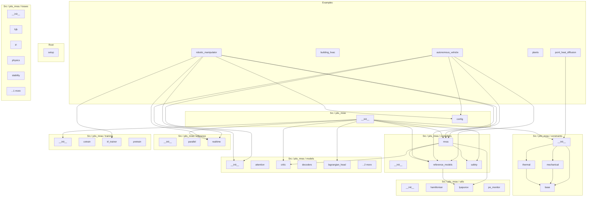

# pits_mras - Dependency Graph

**Version**: 0.4.5 | **Last Updated**: 2026-06-04

Comprehensive dependency graph of all Python modules, imports, exports, functions, classes, and constants in the codebase.

---

## Overview

The codebase is organized into the following modules:

- **examples**: 5 files
- **root**: 1 file
- **src/pits_mras**: 2 files
- **src/pits_mras/constraints**: 4 files
- **src/pits_mras/controllers**: 4 files
- **src/pits_mras/inference**: 3 files
- **src/pits_mras/losses**: 6 files
- **src/pits_mras/models**: 7 files
- **src/pits_mras/training**: 4 files
- **src/pits_mras/utils**: 4 files

---

## Examples Dependencies

### `examples/autonomous_vehicle.py` - Example: autonomous vehicle lateral control (IP §10.2).

**Third-party Dependencies:**
| Package | Import |
|---------|--------|
| `numpy` | `(module)` |
| `torch` | `(module)` |
| `torch` | `(module)` |
| `plants` | `lateral_tyre_step  # noqa: E402  sibling examples module      dt = 0.01     x_p = torch.zeros2     P = engine._cbf_P  # noqa: SLF001  safety matrix stashed by _build_engine     lateral_offset: list[float] = []     error_norm: list[float] = []     cbf_active: list[bool] = []     violation: list[float] = []      for k in rangesteps:         t = k * dt         # Strong lateral wind gust acting on the plant NOT the reference; the         # controller is asked to hold the lane centre against it.         gust = _GUST_AMPLITUDE * math.sin2.0 * math.pi * t / _GUST_PERIOD         out = engine.stepx_p, torch.zeros1, dtype=torch.float32, dt=dt          e = out["e"].detach.cpu.reshape-1         error_norm.appendfloattorch.linalg.vector_norme         cbf_active.appendboolout["cbf_active"]         e_np = e.numpy         violation.appendmax0.0, floate_np @ P @ e_np - _SAFETY_MARGIN         # Record the lateral offset at the CURRENT time before the plant step, # so all series align on the same tgrid.         lateral_offset.appendfloatx_p[0]          # Nonlinear single-track lateral plant with tyre-force saturation         # tanh; linearizes to the reference model near the lane centre.         u = floatout["u_safe"].detach.cpu.reshape-1[0]         x_p = lateral_tyre_step             x_p, u, dt, tyre_stiffness=2.0, damping=3.0, gust=gust               return {         "lateral_offset": lateral_offset, "error_norm": error_norm, "cbf_active": cbf_active, "violation": violation, }   def runsteps: int = 100, show: bool = False -> dict[str, Any]:     """Run with-CBF vs without-CBF lateral control under a wind gust.      Args:         steps: number of fixed-``dt`` control steps to simulate.         show: when ``True`` display + save the figure; otherwise headless Agg.      Returns:         Dict with per-step series for both branches, scalar summary metrics, and         the comparison ``Figure`` under ``"figure"``.     """     import matplotlib      if not show:         matplotlib.use"Agg"      with_cbf = _simulate_build_engineuse_safety_filter=True, steps     without_cbf = _simulate_build_engineuse_safety_filter=False, plt      dt = 0.01     tgrid = [k * dt for k in rangesteps]     fig, axes = plt.subplots1, 3, figsize=15, 4.5     fig.suptitle"Autonomous vehicle lane-hold under a strong wind gust: CBF vs no-CBF"      axes[0].plottgrid, with_cbf["lateral_offset"], label="with CBF"     axes[0].plot         tgrid, without_cbf["lateral_offset"], label="without CBF", linestyle="--"          axes[0].axhline0.0, color="gray", linewidth=0.8     axes[0].set_title"a lateral offset lane departure"     axes[0].set_xlabel"t [s]"     axes[0].set_ylabel"offset [m]"     axes[0].legend      axes[1].plottgrid, with_cbf["error_norm"], label="with CBF"     axes[1].plot         tgrid, without_cbf["error_norm"], label="without CBF", linestyle="--"          axes[1].set_titler"b tracking error $\|et\|$"     axes[1].set_xlabel"t [s]"     axes[1].set_ylabelr"$\|e\|$"     axes[1].legend      axes[2].step         tgrid, [intc for c in with_cbf["cbf_active"]], where="post", color="tab:red", axes[2].set_title"c CBF activation flag with-CBF branch"     axes[2].set_xlabel"t [s]"     axes[2].set_ylabel"active"     axes[2].set_ylim-0.1, 1.1      fig.tight_layout     if show:         fig.savefig"autonomous_vehicle.png", dpi=120         if matplotlib.get_backend.lower != "agg":             plt.show      max_dep_cbf = maxabsx for x in with_cbf["lateral_offset"], default=0.0     max_dep_nocbf = max         absx for x in without_cbf["lateral_offset"], default=0.0          viol_cbf = sumwith_cbf["violation"] * dt     viol_nocbf = sumwithout_cbf["violation"] * dt      return {         "error_norm": with_cbf["error_norm"], "error_norm_no_cbf": without_cbf["error_norm"], "lateral_offset_cbf": with_cbf["lateral_offset"], "lateral_offset_no_cbf": without_cbf["lateral_offset"], "max_departure_cbf": floatmax_dep_cbf, "max_departure_no_cbf": floatmax_dep_nocbf, "safeset_violation_cbf": floatviol_cbf, "safeset_violation_no_cbf": floatviol_nocbf, "cbf_activation_rate":              sumwith_cbf["cbf_active"] / lenwith_cbf["cbf_active"]             if with_cbf["cbf_active"] else 0.0, "steps": steps, "figure": fig, }   def main -> None:     """Run the demo with the comparison figure displayed and saved."""     out = runsteps=100, show=True     printf"CBF activation rate = {out['cbf_activation_rate']:.2%}"     printf"max lateral departure  with CBF = {out['max_departure_cbf']:.4f} m"     printf"max lateral departure   no CBF = {out['max_departure_no_cbf']:.4f} m"     printf"safe-set violation  with CBF = {out['safeset_violation_cbf']:.4f}"     printf"safe-set violation   no CBF = {out['safeset_violation_no_cbf']:.4f}"   if __name__ == "__main__":     main` |

**Standard-library Dependencies:**
| Module | Import |
|--------|--------|
| `__future__` | `annotations` |
| `math` | `(module)` |
| `typing` | `Any` |
| `pathlib` | `(module)` |
| `sys` | `(module)` |

**Internal Dependencies:**
| Module | Imports | Type |
|--------|---------|------|
| `src/pits_mras/config.py` | `NetworkConfig, PhysicsConfig, PITSMRASConfig` | Import |
| `src/pits_mras/controllers/mras.py` | `MRASController` | Import |
| `src/pits_mras/controllers/reference_models.py` | `LinearReferenceModel` | Import |
| `src/pits_mras/inference/realtime.py` | `RealtimeInferenceEngine` | Import |
| `src/pits_mras/models/__init__.py` | `PITNN` | Import |

**Exports:**
- Functions: `run`, `main`

---

### `examples/building_hvac.py` - Example: building HVAC thermal-zone control (IP §10.3).

**Third-party Dependencies:**
| Package | Import |
|---------|--------|
| `torch` | `(module)` |
| `plants` | `rc_thermal_step  # noqa: E402  sibling examples module      nxt = rc_thermal_steptorch.tensor[x0, x1], dtype=torch.float32, u, dt     return floatnxt[0], floatnxt[1]   def _run_pitssteps: int -> dict[str, np     import torch      from pits_mras.config import NetworkConfig, PhysicsConfig, PITSMRASConfig     from pits_mras.controllers.mras import MRASController     from pits_mras.controllers.reference_models import LinearReferenceModel     from pits_mras.inference.realtime import RealtimeInferenceEngine     from pits_mras.models import PITNN      torch.manual_seed0     np.random.seed0      # Reference model = the 2-node RC network's linearization zone, mass, so     # the LQR tracks the zone temperature. A_rc = [[-a_zm+a_za, a_zm], # [a_mz, -a_mz]], B = [[heater_gain], [0]] with the rc_thermal_step defaults.     a_m = np.array[[-3.0, 2.0], [1.0, -1.0]]     b_m = np.array[[3.0], [0.0]]     c_m = np.eye2     q_mat = np.eye2     r_mat = np.eye1     ref_model = LinearReferenceModela_m, b_m, c_m, q_mat, r_mat      cfg = PITSMRASConfig     cfg.network = NetworkConfig         input_dim=2, hidden_dim=16, output_dim=2, lstm_layers=1, attention_heads=2, embedding_dim=8, cfg.physics = PhysicsConfig         n_generalized_coords=1, hamiltonian_hidden=16, dissipation_hidden=8, pitnn = PITNNcfg.network, cfg.physics      controller = MRASController         reference_model=ref_model, state_dim=2, control_dim=1, ref_dim=1, plant_dim=2, use_safety_filter=True, controller.setup_safety_filter     engine = RealtimeInferenceEngine         pitnn, controller, ref_model, horizon=50, device="cpu"           dt = 0.01     x0, x1 = 0.0, 0.0     temp_error: list[float] = []     energy_cum: list[float] = []     energy = 0.0      for k in rangesteps:         t = k * dt         sp = _setpointt         r = torch.tensor[sp], dtype=torch.float32         x_p = torch.tensor[x0, x1], dtype=torch.float32         out = engine.stepx_p, r, dt=dt         u = floatout["u_safe"].detach.cpu.reshape-1[0]         energy += u * u * dt         energy_cum.appendenergy         x0, x1 = _zone_stepx0, x1, u, dt         temp_error.appendabsx0 - sp      return {"temp_error": temp_error, "energy_cum": energy_cum}   def _run_baselinesteps: int, gain: float = 6.0 -> dict[str, list]:     """Run a simple proportional baseline controller on the same toy zone."""     dt = 0.01     x0, x1 = 0.0, 0.0     temp_error: list[float] = []     energy_cum: list[float] = []     energy = 0.0      for k in rangesteps:         t = k * dt         sp = _setpointt         u = gain * sp - x0  # proportional control toward the setpoint         energy += u * u * dt         energy_cum.appendenergy         x0, x1 = _zone_stepx0, x1, u, dt         temp_error.appendabsx0 - sp      return {"temp_error": temp_error, "energy_cum": energy_cum}   def runsteps: int = 100, show: bool = False -> dict[str, Any]:     """Run PITS-MRAS HVAC control vs a simple proportional baseline.      Args:         steps: number of fixed-``dt`` control steps to simulate.         show: when ``True`` display + save the figure; otherwise headless Agg.      Returns:         Dict with per-step series for both controllers, scalar energy/error         summaries, plt      dt = 0.01     tgrid = [k * dt for k in rangesteps]     fig, axes = plt.subplots1, 2, figsize=11, 4.5     fig.suptitle"Building HVAC: PITS-MRAS vs proportional baseline"      axes[0].plottgrid, pits["temp_error"], label="PITS-MRAS"     axes[0].plottgrid, base["temp_error"], label="P baseline", linestyle="--"     axes[0].set_title"zone temperature tracking error"     axes[0].set_xlabel"t [s]"     axes[0].set_ylabel"|T - setpoint| [deg C]"     axes[0].legend      axes[1].plottgrid, pits["energy_cum"], label="PITS-MRAS"     axes[1].plottgrid, base["energy_cum"], label="P baseline", linestyle="--"     axes[1].set_titler"cumulative control energy $\sum u^2\, dt$"     axes[1].set_xlabel"t [s]"     axes[1].set_ylabel"energy [proxy]"     axes[1].legend      fig.tight_layout     if show:         fig.savefig"building_hvac.png", dpi=120         if matplotlib.get_backend.lower != "agg":             plt.show      pits_energy = pits["energy_cum"][-1] if pits["energy_cum"] else 0.0     base_energy = base["energy_cum"][-1] if base["energy_cum"] else 0.0     savings =          base_energy - pits_energy / base_energy if base_energy > 0.0 else 0.0           return {         "temp_error": pits["temp_error"], "error_norm": pits["temp_error"], "temp_error_baseline": base["temp_error"], "energy_cum": pits["energy_cum"], "energy_cum_baseline": base["energy_cum"], "pits_energy": floatpits_energy, "baseline_energy": floatbase_energy, "energy_savings_fraction": floatsavings, "steps": steps, "figure": fig, }   def main -> None:     """Run the demo with the comparison figure displayed and saved."""     out = runsteps=100, show=True     printf"PITS-MRAS control energy = {out['pits_energy']:.4f}"     printf"baseline  control energy = {out['baseline_energy']:.4f}"     printf"energy savings = {out['energy_savings_fraction']:.2%}"   if __name__ == "__main__":     main` |

**Standard-library Dependencies:**
| Module | Import |
|--------|--------|
| `__future__` | `annotations` |
| `math` | `(module)` |
| `typing` | `Any` |
| `pathlib` | `(module)` |
| `sys` | `(module)` |

**Exports:**
- Functions: `run`, `main`

---

### `examples/pcml_heat_diffusion.py` - Example: hard PCML on the 1-D heat equation with real coordinates.

**Third-party Dependencies:**
| Package | Import |
|---------|--------|
| `torch` | `(module)` |
| `matplotlib` | `(module)` |
| `torch` | `(module)` |
| `matplotlib.pyplot` | `(module)` |

**Standard-library Dependencies:**
| Module | Import |
|--------|--------|
| `__future__` | `annotations` |
| `math` | `(module)` |
| `typing` | `Any` |

**Internal Dependencies:**
| Module | Imports | Type |
|--------|---------|------|
| `src/pits_mras/constraints/__init__.py` | `HeatConductionDAE` | Import |
| `src/pits_mras/models/pcml.py` | `PCMLModule, SoftPCMLLoss` | Import |

**Exports:**
- Functions: `run`, `main`

---

### `examples/plants.py` - Nonlinear plant models for the PITS-MRAS examples.

**Third-party Dependencies:**
| Package | Import |
|---------|--------|
| `torch` | `(module)` |
| `torch` | `Tensor` |

**Standard-library Dependencies:**
| Module | Import |
|--------|--------|
| `__future__` | `annotations` |

**Exports:**
- Functions: `pendulum_step`, `lateral_tyre_step`, `rc_thermal_step`

---

### `examples/robotic_manipulator.py` - Example: 2-DOF planar robotic manipulator (IP §10.1).

**Third-party Dependencies:**
| Package | Import |
|---------|--------|
| `matplotlib` | `(module)` |
| `numpy` | `(module)` |
| `torch` | `(module)` |
| `plants` | `pendulum_step  # noqa: E402  sibling examples module      torch.manual_seed0     np.random.seed0      # ---- Reference model: stable 2nd-order joint-tracking model. -------------     # State = [q, qdot] for one tracked joint coordinate; critically damped.     a_m = np.array[[0.0, 1.0], [-4.0, -4.0]]     b_m = np.array[[0.0], [4.0]]     c_m = np.eye2     q_mat = np.eye2     r_mat = np.eye1     ref_model = LinearReferenceModela_m, b_m, c_m, q_mat, r_mat      # ---- PITNN physics-informed dynamics + value. -------------------------     cfg = PITSMRASConfig     cfg.network = NetworkConfig         input_dim=2, hidden_dim=16, output_dim=2, lstm_layers=1, attention_heads=2, embedding_dim=8, cfg.physics = PhysicsConfig         n_generalized_coords=1, hamiltonian_hidden=16, dissipation_hidden=8, pitnn = PITNNcfg.network, cfg.physics      # ---- MRAS controller + CBF safety filter. -------------------------------     controller = MRASController         reference_model=ref_model, state_dim=2, control_dim=1, ref_dim=1, plant_dim=2, use_safety_filter=True, controller.setup_safety_filter      # ---- Train the critic real panel d. ---------------------------------     # The critic is warm-started to the CARE solution P_opt at construction; we     # perturb it well off P_opt, then fit it back with the offline gradient IRL     # trainer on optimal-closed-loop data convex -> reliable monotone     # convergence, decoupled from control-loop stability. Panel d plots this     # genuine learning curve ``||P_hat - P_CARE||_F / ||P_CARE||_F`` per step.     controller.critic.set_Ptorch.eye2, dtype=torch.float32 * 5.0     critic_convergence: list[float] = train_irl_critic_gd         controller.critic, ref_model, n_trajectories=critic_train_trajectories, steps=critic_train_steps, lr=0.15, seed=0, engine = RealtimeInferenceEngine         pitnn, controller, ref_model, horizon=50, device="cpu"           # ---- Closed-loop simulation panels a-c with the trained critic. ---     dt = 0.01     x_p = torch.zeros2     error_norm: list[float] = []     v_hat: list[float] = []     cbf_active: list[bool] = []      for k in rangesteps:         t = k * dt         # Sinusoidal joint-angle reference position command for one joint.         r = torch.tensor             [0.5 * math.sin2.0 * math.pi * 0.5 * t], dtype=torch.float32                  out = engine.stepx_p, r, dt=dt          e = out["e"].detach.cpu.reshape-1         error_norm.appendfloattorch.linalg.vector_norme         v_hat.appendfloatout["v_hat"].detach.reshape-1[0]         cbf_active.appendboolout["cbf_active"]          # Advance the nonlinear pendulum plant sin-gravity joint under the         # applied safe control. Linearizes to the reference model near theta=0.         u = floatout["u_safe"].detach.cpu.reshape-1[0]         x_p = pendulum_stepx_p, u, dt, g_over_l=4.0, plt      fig, axes = plt.subplots2, 2, figsize=10, 7     fig.suptitle"2-DOF manipulator: PITNN-MRAS-CBF closed loop"     tgrid = [k * dt for k in rangesteps]      axes[0, 0].plottgrid, error_norm     axes[0, 0].set_titler"a tracking error $\|et\|$"     axes[0, 0].set_xlabel"t [s]"     axes[0, 0].set_ylabelr"$\|e\|$"      axes[0, 1].plottgrid, v_hat, color="tab:orange"     axes[0, 1].set_titler"b critic value $\hat Vet$"     axes[0, 1].set_xlabel"t [s]"     axes[0, 1].set_ylabelr"$\hat V$"      axes[1, 0].step         tgrid, [intc for c in cbf_active], where="post", color="tab:red"          axes[1, 0].set_title"c CBF activation flag"     axes[1, 0].set_xlabel"t [s]"     axes[1, 0].set_ylabel"active"     axes[1, 0].set_ylim-0.1, 1.1      axes[1, 1].plot         rangelencritic_convergence, critic_convergence, color="tab:green"          axes[1, 1].set_title         r"d IRL critic training conv. $\|\hat P-P_{CARE}\|_F/\|P_{CARE}\|_F$"          axes[1, 1].set_xlabel"training step"     axes[1, 1].set_ylabel"rel. error"      fig.tight_layout     if show:         fig.savefig"robotic_manipulator.png", dpi=120         if matplotlib.get_backend.lower != "agg":             plt.show      return {         "error_norm": error_norm, "v_hat": v_hat, "cbf_active": cbf_active, "critic_convergence": critic_convergence, "final_error_norm": error_norm[-1] if error_norm else 0.0, "final_critic_convergence":              critic_convergence[-1] if critic_convergence else 0.0, "cbf_activation_rate":              sumcbf_active / lencbf_active if cbf_active else 0.0, "steps": steps, "figure": fig, }   def main -> None:     """Run the demo with the diagnostic figure displayed and saved."""     out = runsteps=100, show=True     printf"final ||e|| = {out['final_error_norm']:.4f}"     printf"final critic convergence = {out['final_critic_convergence']:.4f}"     printf"CBF activation rate = {out['cbf_activation_rate']:.2%}"   if __name__ == "__main__":     main` |

**Standard-library Dependencies:**
| Module | Import |
|--------|--------|
| `__future__` | `annotations` |
| `math` | `(module)` |
| `typing` | `Any` |
| `pathlib` | `(module)` |
| `sys` | `(module)` |

**Internal Dependencies:**
| Module | Imports | Type |
|--------|---------|------|
| `src/pits_mras/config.py` | `NetworkConfig, PhysicsConfig, PITSMRASConfig` | Import |
| `src/pits_mras/controllers/mras.py` | `MRASController` | Import |
| `src/pits_mras/controllers/reference_models.py` | `LinearReferenceModel` | Import |
| `src/pits_mras/inference/realtime.py` | `RealtimeInferenceEngine` | Import |
| `src/pits_mras/models/__init__.py` | `PITNN` | Import |
| `src/pits_mras/training/irl_trainer.py` | `train_irl_critic_gd` | Import |

**Exports:**
- Functions: `run`, `main`

---

## Root Dependencies

### `setup.py` - setup module

**Third-party Dependencies:**
| Package | Import |
|---------|--------|
| `setuptools` | `find_packages, setup` |

---

## Src / pits_mras Dependencies

### `src/pits_mras/__init__.py` - PITS-MRAS: Physics-Informed Time-Series Model-Reference Adaptive Systems.

**Internal Dependencies:**
| Module | Imports | Type |
|--------|---------|------|
| `src/pits_mras/constraints/__init__.py` | `ConstraintSpec, HeatConductionDAE, MechanicalDAE, PhysicsConstraints` | Re-export |
| `src/pits_mras/controllers/mras.py` | `MRASController` | Re-export |
| `src/pits_mras/controllers/reference_models.py` | `LinearReferenceModel` | Re-export |
| `src/pits_mras/controllers/safety.py` | `CLFCBFSafetyFilter` | Re-export |
| `src/pits_mras/inference/realtime.py` | `RealtimeInferenceEngine` | Re-export |
| `src/pits_mras/models/critic.py` | `QuadraticCritic` | Re-export |
| `src/pits_mras/models/lagrangian_head.py` | `LagrangianMultiplierHead` | Re-export |
| `src/pits_mras/models/pcml.py` | `KKTProjectionLayer, PCMLModule, SoftPCMLLoss, TaylorNeighborhoodApproximation` | Re-export |
| `src/pits_mras/models/pitnn.py` | `PITNN` | Re-export |
| `src/pits_mras/training/__init__.py` | `cotraining_loop, pretrain_pitnn` | Re-export |

**Exports:**
- Re-exports: `ConstraintSpec`, `HeatConductionDAE`, `MechanicalDAE`, `PhysicsConstraints`, `MRASController`, `LinearReferenceModel`, `CLFCBFSafetyFilter`, `RealtimeInferenceEngine`, `QuadraticCritic`, `LagrangianMultiplierHead`, `KKTProjectionLayer`, `PCMLModule`, `SoftPCMLLoss`, `TaylorNeighborhoodApproximation`, `PITNN`, `cotraining_loop`, `pretrain_pitnn`

---

### `src/pits_mras/config.py` - Centralized configuration for PITS-MRAS (IP §4.2).

**Third-party Dependencies:**
| Package | Import |
|---------|--------|
| `torch` | `(module)` |
| `yaml` | `(module)` |

**Standard-library Dependencies:**
| Module | Import |
|--------|--------|
| `dataclasses` | `(module)` |
| `dataclasses` | `dataclass, field` |
| `typing` | `List, Optional` |

**Exports:**
- Classes: `NetworkConfig`, `PhysicsConfig`, `MRASConfig`, `SafetyConfig`, `LossConfig`, `TrainingConfig`, `PCMLConfig`, `PITSMRASConfig`

---

## Src / pits_mras / constraints Dependencies

### `src/pits_mras/constraints/__init__.py` - Physics constraint systems for PCML (PCML Addendum §2.1).

**Internal Dependencies:**
| Module | Imports | Type |
|--------|---------|------|
| `src/pits_mras/constraints/base.py` | `ConstraintSpec, PhysicsConstraints` | Re-export |
| `src/pits_mras/constraints/mechanical.py` | `MechanicalDAE` | Re-export |
| `src/pits_mras/constraints/thermal.py` | `HeatConductionDAE` | Re-export |

**Exports:**
- Re-exports: `ConstraintSpec`, `PhysicsConstraints`, `MechanicalDAE`, `HeatConductionDAE`

---

### `src/pits_mras/constraints/base.py` - Base classes for physics constraint specifications (PCML Addendum §2.1).

**Third-party Dependencies:**
| Package | Import |
|---------|--------|
| `torch` | `Tensor` |

**Standard-library Dependencies:**
| Module | Import |
|--------|--------|
| `abc` | `ABC, abstractmethod` |
| `dataclasses` | `dataclass` |

**Exports:**
- Classes: `ConstraintSpec`
- Protocols/ABCs: `PhysicsConstraints`

---

### `src/pits_mras/constraints/mechanical.py` - Mechanical-system constraints: Euler-Lagrange DAEs (PCML Addendum §2.1).

**Third-party Dependencies:**
| Package | Import |
|---------|--------|
| `torch` | `(module)` |
| `torch` | `Tensor` |

**Standard-library Dependencies:**
| Module | Import |
|--------|--------|
| `typing` | `Callable, Optional, Tuple` |

**Internal Dependencies:**
| Module | Imports | Type |
|--------|---------|------|
| `src/pits_mras/constraints/base.py` | `ConstraintSpec, PhysicsConstraints` | Import |

**Exports:**
- Classes: `MechanicalDAE`

---

### `src/pits_mras/constraints/thermal.py` - Thermal-system constraints for HVAC / heat conduction (PCML Addendum §2.1).

**Third-party Dependencies:**
| Package | Import |
|---------|--------|
| `torch` | `(module)` |
| `torch` | `Tensor` |

**Internal Dependencies:**
| Module | Imports | Type |
|--------|---------|------|
| `src/pits_mras/constraints/base.py` | `ConstraintSpec, PhysicsConstraints` | Import |

**Exports:**
- Classes: `HeatConductionDAE`

---

## Src / pits_mras / controllers Dependencies

### `src/pits_mras/controllers/__init__.py` - Controllers subpackage: reference models, CLF-CBF safety filter, MRAS actor.

---

### `src/pits_mras/controllers/mras.py` - Actor-critic MRAS controller (IP §7.3). Identities 1, 2, 3, 4.

**Third-party Dependencies:**
| Package | Import |
|---------|--------|
| `torch` | `(module)` |
| `torch.nn` | `(module)` |
| `torch` | `Tensor` |

**Standard-library Dependencies:**
| Module | Import |
|--------|--------|
| `typing` | `Dict, Optional, Tuple` |

**Internal Dependencies:**
| Module | Imports | Type |
|--------|---------|------|
| `src/pits_mras/controllers/reference_models.py` | `LinearReferenceModel` | Import |
| `src/pits_mras/controllers/safety.py` | `CLFCBFSafetyFilter` | Import |
| `src/pits_mras/models/critic.py` | `CostateHead, QuadraticCritic` | Import |
| `src/pits_mras/utils/lyapunov.py` | `solve_care` | Import |

**Exports:**
- Classes: `MRASController`

---

### `src/pits_mras/controllers/reference_models.py` - Linear reference model (IP §7.1).

**Third-party Dependencies:**
| Package | Import |
|---------|--------|
| `numpy` | `(module)` |
| `torch` | `(module)` |
| `torch.nn` | `(module)` |
| `torch` | `Tensor` |

**Internal Dependencies:**
| Module | Imports | Type |
|--------|---------|------|
| `src/pits_mras/utils/lyapunov.py` | `check_hurwitz, kleinman_iteration, solve_lyapunov` | Import |

**Exports:**
- Classes: `LinearReferenceModel`

---

### `src/pits_mras/controllers/safety.py` - CLF-CBF-QP safety filter (IP §7.2 / §3.4). NEW -- Identity 3.

**Third-party Dependencies:**
| Package | Import |
|---------|--------|
| `torch.nn` | `(module)` |
| `torch.nn.functional` | `(module)` |
| `torch` | `Tensor` |

**Standard-library Dependencies:**
| Module | Import |
|--------|--------|
| `typing` | `Tuple` |

**Exports:**
- Classes: `CLFCBFSafetyFilter`

---

## Src / pits_mras / inference Dependencies

### `src/pits_mras/inference/__init__.py` - Inference subpackage: real-time engine and parallel thread architecture.

---

### `src/pits_mras/inference/parallel.py` - Parallel thread architecture for deployment (IP §9.2).

**Third-party Dependencies:**
| Package | Import |
|---------|--------|
| `torch` | `(module)` |
| `torch` | `Tensor` |

**Standard-library Dependencies:**
| Module | Import |
|--------|--------|
| `copy` | `(module)` |
| `threading` | `(module)` |
| `time` | `(module)` |
| `collections` | `deque` |
| `dataclasses` | `dataclass` |
| `typing` | `Callable, Deque, List, Optional, Tuple` |

**Internal Dependencies:**
| Module | Imports | Type |
|--------|---------|------|
| `src/pits_mras/inference/realtime.py` | `RealtimeInferenceEngine` | Import |
| `src/pits_mras/losses/irl.py` | `IRLBellmanLoss` | Import |

**Exports:**
- Classes: `ControllerState`, `ParallelInferenceEngine`

---

### `src/pits_mras/inference/realtime.py` - Real-time closed-loop inference engine (IP §9.1).

**Third-party Dependencies:**
| Package | Import |
|---------|--------|
| `torch` | `(module)` |
| `torch` | `Tensor` |

**Standard-library Dependencies:**
| Module | Import |
|--------|--------|
| `threading` | `(module)` |
| `collections` | `deque` |
| `typing` | `TYPE_CHECKING, Any, Deque, Dict, Optional` |

**Internal Dependencies:**
| Module | Imports | Type |
|--------|---------|------|
| `src/pits_mras/controllers/mras.py` | `MRASController` | Import |
| `src/pits_mras/controllers/reference_models.py` | `LinearReferenceModel` | Import |
| `src/pits_mras/models/pitnn.py` | `PITNN` | Import |
| `src/pits_mras/models/pcml.py` | `PCMLModule` | Import (TYPE_CHECKING) |

**Exports:**
- Classes: `RealtimeInferenceEngine`

---

## Src / pits_mras / losses Dependencies

### `src/pits_mras/losses/__init__.py` - Loss functions for PITS-MRAS (Phase 3).

**Third-party Dependencies:**
| Package | Import |
|---------|--------|
| `torch` | `(module)` |
| `torch.nn` | `(module)` |

**Standard-library Dependencies:**
| Module | Import |
|--------|--------|
| `__future__` | `annotations` |

**Internal Dependencies:**
| Module | Imports | Type |
|--------|---------|------|
| `src/pits_mras/config.py` | `LossConfig` | Re-export |
| `src/pits_mras/losses/hjb.py` | `HJBResidualLoss, LyapunovDecreaseEnforcer` | Re-export |
| `src/pits_mras/losses/irl.py` | `IRLBellmanAccumulator, IRLBellmanLoss` | Re-export |
| `src/pits_mras/losses/physics.py` | `PhysicsLoss` | Re-export |
| `src/pits_mras/losses/stability.py` | `ControlEffortLoss, LyapunovConstraintLoss, MRASStabilityLoss, ParameterBoundednessLoss` | Re-export |
| `src/pits_mras/losses/temporal.py` | `AttentionRegularizationLoss, MultiStepPredictionLoss, TemporalLoss, TemporalSmoothnessLoss` | Re-export |

**Exports:**
- Classes: `TotalLoss`
- Re-exports: `LossConfig`, `HJBResidualLoss`, `LyapunovDecreaseEnforcer`, `IRLBellmanAccumulator`, `IRLBellmanLoss`, `PhysicsLoss`, `ControlEffortLoss`, `LyapunovConstraintLoss`, `MRASStabilityLoss`, `ParameterBoundednessLoss`, `AttentionRegularizationLoss`, `MultiStepPredictionLoss`, `TemporalLoss`, `TemporalSmoothnessLoss`

---

### `src/pits_mras/losses/hjb.py` - HJB residual loss (Phase 3).

**Third-party Dependencies:**
| Package | Import |
|---------|--------|
| `torch` | `(module)` |
| `torch.nn` | `(module)` |

**Standard-library Dependencies:**
| Module | Import |
|--------|--------|
| `__future__` | `annotations` |

**Internal Dependencies:**
| Module | Imports | Type |
|--------|---------|------|
| `src/pits_mras/models/critic.py` | `QuadraticCritic` | Import |

**Exports:**
- Classes: `HJBResidualLoss`, `LyapunovDecreaseEnforcer`

---

### `src/pits_mras/losses/irl.py` - Inverse-RL Bellman residual loss (Phase 3).

**Third-party Dependencies:**
| Package | Import |
|---------|--------|
| `torch` | `(module)` |
| `torch.nn` | `(module)` |

**Standard-library Dependencies:**
| Module | Import |
|--------|--------|
| `__future__` | `annotations` |

**Internal Dependencies:**
| Module | Imports | Type |
|--------|---------|------|
| `src/pits_mras/models/critic.py` | `QuadraticCritic` | Import |

**Exports:**
- Classes: `IRLBellmanAccumulator`, `IRLBellmanLoss`

---

### `src/pits_mras/losses/physics.py` - Physics-informed loss (Phase 3).

**Third-party Dependencies:**
| Package | Import |
|---------|--------|
| `torch` | `(module)` |
| `torch.nn` | `(module)` |

**Standard-library Dependencies:**
| Module | Import |
|--------|--------|
| `__future__` | `annotations` |

**Exports:**
- Classes: `PhysicsLoss`

---

### `src/pits_mras/losses/stability.py` - Stability-constraint losses (Phase 3).

**Third-party Dependencies:**
| Package | Import |
|---------|--------|
| `torch` | `(module)` |
| `torch.nn` | `(module)` |

**Standard-library Dependencies:**
| Module | Import |
|--------|--------|
| `__future__` | `annotations` |
| `typing` | `Iterable` |

**Exports:**
- Classes: `LyapunovConstraintLoss`, `ParameterBoundednessLoss`, `ControlEffortLoss`, `MRASStabilityLoss`

---

### `src/pits_mras/losses/temporal.py` - Temporal / multi-step prediction loss (Phase 3).

**Third-party Dependencies:**
| Package | Import |
|---------|--------|
| `torch` | `(module)` |
| `torch.nn` | `(module)` |

**Standard-library Dependencies:**
| Module | Import |
|--------|--------|
| `__future__` | `annotations` |

**Exports:**
- Classes: `MultiStepPredictionLoss`, `TemporalSmoothnessLoss`, `AttentionRegularizationLoss`, `TemporalLoss`

---

## Src / pits_mras / models Dependencies

### `src/pits_mras/models/__init__.py` - Models subpackage: attention, port-Hamiltonian decoders, critic/costate, PITNN.

**Internal Dependencies:**
| Module | Imports | Type |
|--------|---------|------|
| `src/pits_mras/models/attention.py` | `PhysicsInformedAttention` | Re-export |
| `src/pits_mras/models/critic.py` | `AdversaryHead, CostateHead, QuadraticCritic` | Re-export |
| `src/pits_mras/models/decoders.py` | `DissipationNet, HamiltonianNet, PortHamiltonianDecoder` | Re-export |
| `src/pits_mras/models/pitnn.py` | `PITNN` | Re-export |

**Exports:**
- Re-exports: `PhysicsInformedAttention`, `AdversaryHead`, `CostateHead`, `QuadraticCritic`, `DissipationNet`, `HamiltonianNet`, `PortHamiltonianDecoder`, `PITNN`

---

### `src/pits_mras/models/attention.py` - Multi-head physics-informed attention (IP §5.1).

**Third-party Dependencies:**
| Package | Import |
|---------|--------|
| `torch` | `(module)` |
| `torch.nn` | `(module)` |
| `torch.nn.functional` | `(module)` |
| `torch` | `Tensor` |

**Standard-library Dependencies:**
| Module | Import |
|--------|--------|
| `math` | `(module)` |

**Exports:**
- Classes: `PhysicsInformedAttention`

---

### `src/pits_mras/models/critic.py` - Critic / value network and costate head (IP §5.3). NEW -- Identity 1 & 2.

**Third-party Dependencies:**
| Package | Import |
|---------|--------|
| `torch` | `(module)` |
| `torch.nn` | `(module)` |
| `torch` | `Tensor` |

**Internal Dependencies:**
| Module | Imports | Type |
|--------|---------|------|
| `src/pits_mras/utils/lyapunov.py` | `pack_symmetric, quadratic_basis, unpack_symmetric` | Import |

**Exports:**
- Classes: `QuadraticCritic`, `CostateHead`, `AdversaryHead`

---

### `src/pits_mras/models/decoders.py` - Port-Hamiltonian decoders (IP §5.2).

**Third-party Dependencies:**
| Package | Import |
|---------|--------|
| `torch` | `(module)` |
| `torch.nn` | `(module)` |
| `torch.nn.functional` | `(module)` |
| `torch` | `Tensor` |

**Internal Dependencies:**
| Module | Imports | Type |
|--------|---------|------|
| `src/pits_mras/utils/hamiltonian.py` | `hamiltonian_positivity_loss, make_positive_definite, make_skew_symmetric, port_hamiltonian_energy_loss` | Import |

**Exports:**
- Classes: `HamiltonianNet`, `DissipationNet`, `PortHamiltonianDecoder`

---

### `src/pits_mras/models/lagrangian_head.py` - Lagrangian-multiplier head for the KKT projection (PCML Addendum §2.3).

**Third-party Dependencies:**
| Package | Import |
|---------|--------|
| `torch` | `(module)` |
| `torch.nn` | `(module)` |
| `torch` | `Tensor` |

**Exports:**
- Classes: `LagrangianMultiplierHead`

---

### `src/pits_mras/models/pcml.py` - Physics-Constrained Machine Learning (PCML) module for PITS-MRAS.

**Third-party Dependencies:**
| Package | Import |
|---------|--------|
| `torch` | `(module)` |
| `torch.nn` | `(module)` |
| `torch.nn.functional` | `(module)` |
| `torch` | `Tensor` |

**Standard-library Dependencies:**
| Module | Import |
|--------|--------|
| `logging` | `(module)` |
| `typing` | `Dict, List, Optional, Tuple` |

**Internal Dependencies:**
| Module | Imports | Type |
|--------|---------|------|
| `src/pits_mras/constraints/base.py` | `PhysicsConstraints` | Import |

**Exports:**
- Classes: `SoftPCMLLoss`, `TaylorNeighborhoodApproximation`, `KKTProjectionLayer`, `PCMLModule`

---

### `src/pits_mras/models/pitnn.py` - Top-level physics-informed time-series network -- PITNN (IP §5.4).

**Third-party Dependencies:**
| Package | Import |
|---------|--------|
| `torch` | `(module)` |
| `torch.nn` | `(module)` |
| `torch` | `Tensor` |

**Standard-library Dependencies:**
| Module | Import |
|--------|--------|
| `typing` | `Dict, Optional` |

**Internal Dependencies:**
| Module | Imports | Type |
|--------|---------|------|
| `src/pits_mras/config.py` | `NetworkConfig, PhysicsConfig` | Import |
| `src/pits_mras/models/attention.py` | `PhysicsInformedAttention` | Import |
| `src/pits_mras/models/decoders.py` | `PortHamiltonianDecoder` | Import |

**Exports:**
- Classes: `PITNN`

---

## Src / pits_mras / training Dependencies

### `src/pits_mras/training/__init__.py` - Training subpackage: physics pretrain, IRL co-train, offline IRL trainer.

**Internal Dependencies:**
| Module | Imports | Type |
|--------|---------|------|
| `src/pits_mras/training/cotrain.py` | `cotraining_loop` | Re-export |
| `src/pits_mras/training/irl_trainer.py` | `train_irl_critic` | Re-export |
| `src/pits_mras/training/pretrain.py` | `pretrain_pitnn` | Re-export |

**Exports:**
- Re-exports: `cotraining_loop`, `train_irl_critic`, `pretrain_pitnn`

---

### `src/pits_mras/training/cotrain.py` - Co-training pipeline with IRL critic updates (Algorithm 3 extended, §8.2).

**Third-party Dependencies:**
| Package | Import |
|---------|--------|
| `torch` | `(module)` |
| `torch` | `Tensor` |

**Standard-library Dependencies:**
| Module | Import |
|--------|--------|
| `__future__` | `annotations` |
| `logging` | `(module)` |
| `collections` | `deque` |
| `typing` | `TYPE_CHECKING, Deque` |

**Internal Dependencies:**
| Module | Imports | Type |
|--------|---------|------|
| `src/pits_mras/losses/hjb.py` | `HJBResidualLoss` | Import |
| `src/pits_mras/losses/irl.py` | `IRLBellmanLoss` | Import |
| `src/pits_mras/config.py` | `PITSMRASConfig` | Import (TYPE_CHECKING) |
| `src/pits_mras/controllers/mras.py` | `MRASController` | Import (TYPE_CHECKING) |
| `src/pits_mras/controllers/reference_models.py` | `LinearReferenceModel` | Import (TYPE_CHECKING) |
| `src/pits_mras/models/__init__.py` | `PITNN` | Import (TYPE_CHECKING) |
| `src/pits_mras/models/pcml.py` | `PCMLModule` | Import (TYPE_CHECKING) |

**Exports:**
- Functions: `cotraining_loop`

---

### `src/pits_mras/training/irl_trainer.py` - Offline IRL critic trainer (batch least-squares, §8.3).

**Third-party Dependencies:**
| Package | Import |
|---------|--------|
| `torch` | `(module)` |
| `torch` | `Tensor` |

**Standard-library Dependencies:**
| Module | Import |
|--------|--------|
| `__future__` | `annotations` |
| `logging` | `(module)` |
| `typing` | `TYPE_CHECKING` |

**Internal Dependencies:**
| Module | Imports | Type |
|--------|---------|------|
| `src/pits_mras/utils/lyapunov.py` | `quadratic_basis, unpack_symmetric` | Import |
| `src/pits_mras/controllers/reference_models.py` | `LinearReferenceModel` | Import (TYPE_CHECKING) |
| `src/pits_mras/models/critic.py` | `QuadraticCritic` | Import (TYPE_CHECKING) |
| `src/pits_mras/losses/irl.py` | `IRLBellmanLoss` | Import |

**Exports:**
- Functions: `train_irl_critic_gd`, `train_irl_critic`

---

### `src/pits_mras/training/pretrain.py` - Physics-informed pre-training curriculum (IP §8.1, Algorithm 2).

**Third-party Dependencies:**
| Package | Import |
|---------|--------|
| `torch` | `(module)` |
| `torch` | `Tensor` |

**Standard-library Dependencies:**
| Module | Import |
|--------|--------|
| `__future__` | `annotations` |
| `logging` | `(module)` |
| `math` | `(module)` |
| `typing` | `TYPE_CHECKING, Callable` |

**Internal Dependencies:**
| Module | Imports | Type |
|--------|---------|------|
| `src/pits_mras/config.py` | `PITSMRASConfig` | Import (TYPE_CHECKING) |
| `src/pits_mras/models/__init__.py` | `PITNN` | Import (TYPE_CHECKING) |

**Exports:**
- Functions: `data_weight_schedule`, `temporal_weight_schedule`, `pretrain_pitnn`

---

## Src / pits_mras / utils Dependencies

### `src/pits_mras/utils/__init__.py` - Utils subpackage: Lyapunov/Riccati engine, port-Hamiltonian, PE monitor.

---

### `src/pits_mras/utils/hamiltonian.py` - Port-Hamiltonian utilities (IP §4.4).

**Third-party Dependencies:**
| Package | Import |
|---------|--------|
| `torch` | `(module)` |
| `torch.nn.functional` | `(module)` |
| `torch` | `Tensor` |

**Exports:**
- Functions: `make_skew_symmetric`, `make_positive_definite`, `port_hamiltonian_energy_loss`, `hamiltonian_positivity_loss`

---

### `src/pits_mras/utils/lyapunov.py` - Lyapunov / Riccati engine (IP §4.3). "The mathematical engine for all P."

**Third-party Dependencies:**
| Package | Import |
|---------|--------|
| `numpy` | `(module)` |
| `torch` | `(module)` |
| `scipy.linalg` | `schur, solve_continuous_are, solve_continuous_lyapunov` |
| `torch` | `Tensor` |

**Standard-library Dependencies:**
| Module | Import |
|--------|--------|
| `functools` | `lru_cache` |
| `typing` | `Optional, Tuple, Union` |

**Exports:**
- Functions: `solve_lyapunov`, `kleinman_iteration`, `solve_care`, `solve_gare`, `check_hurwitz`, `lyapunov_derivative`, `quadratic_basis`, `pack_symmetric`, `unpack_symmetric`

---

### `src/pits_mras/utils/pe_monitor.py` - Persistence-of-excitation monitor (IP §4.5).

**Third-party Dependencies:**
| Package | Import |
|---------|--------|
| `torch` | `(module)` |
| `torch` | `Tensor` |

**Standard-library Dependencies:**
| Module | Import |
|--------|--------|
| `collections` | `deque` |
| `typing` | `Deque` |

**Exports:**
- Classes: `PEMonitor`

---

## Circular Dependency Analysis

**No circular dependencies detected.**
---

## Visual Dependency Graph

---

## Summary Statistics

| Category | Count |
|----------|-------|
| Total Python Files | 40 |
| Total Modules | 10 |
| Total Lines of Code | 5687 |
| Total Public Exports | 122 |
| Total Re-exports | 46 |
| Total Classes | 45 |
| Total Protocols/ABCs | 1 |
| Total Enums | 0 |
| Total Functions | 30 |
| Total Type Guards (is_*) | 0 |
| Total Constants | 0 |
| TYPE_CHECKING Imports | 10 |
| Runtime Circular Deps | 0 |
| TYPE_CHECKING Circular Deps | 0 |
| Potentially Unused Files | 0 |
| Potentially Unused Exports | 0 |

*Last Updated*: 2026-06-04  |  *Version*: 0.4.5
